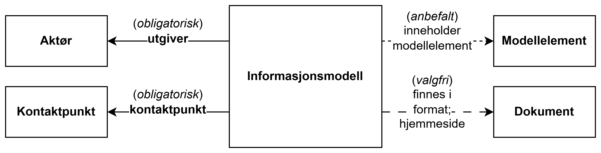

== Forenklet fremstilling av kravene i ModellDCAT-AP-NO [[Forenklet-fremstilling]]

_Denne delen av spesifikasjonen er primært ment for den ikke-tekniske målgruppen._ 

:xrefstyle: short

Som illustrert i <> gir ModellDCAT-AP-NO mulighet til å beskrive informasjonsmodeller. 

[[img-ForenkletModell]]
.Forenklet fremstilling av ModellDCAT-AP-NO
[link=images/ModellDCAT-AP-NO-forenklet-fremstilling.png]

Helt overordnet illustrerer figuren bl.a. følgende:

* til en informasjonsmodell skal (obligartorisk) det oppgis 
** aktøren/virksomheten som er ansvarlig for å gjøre modellen tilgjengelig, i teningen kalt «utgiver»
** kontaktpunkt(er) som kan brukes ved spørsmål om modellen 

* til en informasjonsmodell bør (anbefalt) det beskrives hvilke modellelementer modellen inneholder

* til en informasjonsmodell kan (valgfritt) det tas med henvisninger til 
** side(r) (dokument(er)) som viser modellen i ulike formater, f.eks. en eller flere bildefiler som viser modellen
** hjemmesiden (dokument) til modellen, f.eks. en webside som viser og forklarer modellen

Det er med andre ord _ikke_ nødvendig å ha beskrevet alle modellelementene i modellen din i henhold til kravene i denne spesifikasjonen, før du kan fortelle verden at du har laget en informasjonsmodell. 

Hvilke typer opplysninger som SKAL (obligatoriske), BØR (anbefalte) og KAN (valgfrie) tas med i beskrivelse av en Informasjonsmodell, et Modellelement, en Aktør og et Kontaktpunkt, er nærmere spesifisert i det følgende i dette kapittelet. Hvordan opplysningene skal representeres teknisk i RDF (https://www.w3.org/RDF/[Resource Description Framework &#x29C9;, window="_blank", role="ext-link"]) er spesifisert i kap. <<Spesifikasjon-per-klasse>>, som også innehlder flere klasser som kan brukes i tillegg til de som er vist i <> og beskrevet i dette kapittelet.

=== Krav til beskrivelse av en Informasjonsmodell[[krav-til-informasjonsmodell]]

Opplistinen i dette kapitlet er ikke komplett. Kap. <<Informasjonsmodell>> kan inneholde flere egenskaper som kommer i tillegg til de som er tatt med i tabellene under.

[[Tabell-obligatoriske-opplysninger-informasjonsmodell]]
.Obligatoriske opplysningstyper som en beskrivelse av Informasjonsmodell SKAL inneholde
[cols="20s,65d,15d", options="header"]
|===
| Obligatorisk | Forklaring | Ref. til <<Spesifikasjon-per-klasse>>
| kontaktpunkt | kontaktpunkt som kan brukes ved spørsmål om modellen | <<Informasjonsmodell-kontaktpunkt>>
| tittel | navnet på modellen | <<Informasjonsmodell-tittel>>
| utgiver | aktøren (virksomheten) som er ansvarlig for å gjøre modellen tilgjengelig | <<Informasjonsmodell-utgiver>>
|===

[[Tabell-anbefalte-opplysninger-informasjonsmodell]]
.Noen av de anbefalte opplysningstypene som en beskrivelse av Informasjonsmodell BØR inneholde
[cols="20s,65d,15d", options="header"]
|===
| Anbefalt | Forklaring | Ref. til <<Spesifikasjon-per-klasse>>
| begrep | begrep som er viktige for å forstå og tolke modellen | <<Informasjonsmodell-begrep>>
| beskrivelse | en fritekstbeskrivelse av modellen | <<Informasjonsmodell-beskrivelse>>
| modellelement | modellelement som modellen inneholder | <<Informasjonsmodell-inneholder-modellelement>>
| lisens | lisens som gjelder for viderebruk av modellen | <<Informasjonsmodell-lisens>>
|===

[[Tabell-valgfrie-opplysninger-informasjonsmodell]]
.Noen av de valgfrie opplysningstypene som en beskrivelse av Informasjonsmodell KAN inneholde
[cols="20s,65d,15d", options="header"]
|===
| Valgfritt | Forklaring | Ref. til <<Spesifikasjon-per-klasse>>
| endringsdato | dato for siste endring av modellen | <<Informasjonsmodell-endringsdato>>
| finnes i format | dokument som representerer modellen i et annet format | <<Informasjonsmodell-finnes-i-format>>
| hjemmeside | hjemmesiden til modellen | <<Informasjonsmodell-hjemmeside>>
| modellstatus | modellens modenhet | <<Informasjonsmodell-modellstatus>>
| språk | språk som er brukt i modellen | <<Informasjonsmodell-språk>>
| type | type informasjonsmodell | <<Informasjonsmodell-type>>
| utgivelsesdato | dato for når modellen ble gjort tilgjengelig | <<Informasjonsmodell-utgivelsesdato>>
| versjon | versjonsnummer eller annen versjonsangivelse for modellen | <<Informasjonsmodell-versjon>>
|===

=== Krav til beskrivelse av et Modellelement [[krav-til-modellelement]]

Opplistinen i dette kapitlet er ikke komplett. Kap. <<Modellelement>> kan inneholde flere egenskaper som kommer i tillegg til de som er tatt med i tabellene under.

[[Tabell-obligatoriske-opplysninger-modellelement]]
.Obligatoriske opplysningstyper som en beskrivelse av Modellelement SKAL inneholde
[cols="20s,65d,15d", options="header"]
|===
| Obligatorisk | Forklaring | Ref. til <<Spesifikasjon-per-klasse>>
| tittel | navnet på modellelementet | <<Modellelement-tittel>>
|===

[[Tabell-anbefalte-opplysninger-modellelement]] 
.NOen av de anbefalte opplysningstypene som en beskrivelse av Modellelement BØR inneholde
[cols="20s,65d,15d", options="header"]
|===
| Anbefalt | Forklaring | Ref. til <<Spesifikasjon-per-klasse>>
| begrep | begrep som er viktige for å forstå og tolke modellelementet | <<Modellelement-begrep>>
| har egenskap | egenskap som modellelementet har | <<Modellelement-har-egenskap>>
|===

[[Tabell-valgfrie-opplysninger-modellelement]]
.Noen av de valgfrie opplysningstypene som en beskrivelse av Modellelement KAN inneholde
[cols="20s,65d,15d", options="header"]
|===
| Valgfritt | Forklaring | Ref. til <<Spesifikasjon-per-klasse>>
| beskrivelse | fritekstbeskrivelse av modellelementet | <<Modellelement-beskrivelse>>
|===

=== Krav til beskrivelse av en Aktør [[krav-til-aktor]]

Opplistinen i dette kapitlet er ikke komplett. Kap. <<Aktør>> kan inneholde flere egenskaper som kommer i tillegg til de som er tatt med i tabellene under.

[[Tabell-obligatoriske-opplysninger-aktor]]
.Obligatoriske opplysningstyper som en beskrivelse av Aktør SKAL inneholde
[cols="20s,65d,15d", options="header"]
|===
| Obligatorisk | Forklaring | Ref. til <<Spesifikasjon-per-klasse>>
| navn  | navnet til aktøren | <<Aktør-navn>>
|===

[[Tabell-anbefalte-opplysninger-aktor]] 
.Noen av de anbefalte opplysningstypene som en beskrivelse av Aktør BØR inneholde
[cols="20s,65d,15d", options="header"]
|===
| Anbefalt | Forklaring | Ref. til <<Spesifikasjon-per-klasse>>
| type | type aktør, f.eks. nasjonal myndighet, lokal myndighet, privat virksomhet osv. | <<Aktør-type>>
|===

=== Krav til beskrivelse av et Kontaktpunkt [[krav-til-kontaktpunkt]]

Opplistinen i dette kapitlet er ikke komplett. Kap. <<Kontaktpunkt>> kan inneholde flere egenskaper som kommer i tillegg til de som er tatt med i tabellene under.

[[Tabell-obligatoriske-opplysninger-kontaktpunkt]]
.Obligatoriske opplysningstyper som en beskrivelse av Kontaktpunkt SKAL inneholde
[cols="20s,65d,15d", options="header"]
|===
| Obligatorisk | Forklaring | Ref. til <<Spesifikasjon-per-klasse>>
| fullt navn | navnet på kontaktpunktet | <<Kontaktpunkt-fullt-navn>>
|===

[[Tabell-anbefalte-opplysninger-kontaktpunkt]] 
.Noen av de anbefalte opplysningstypene som en beskrivelse av Kontaktpunkt BØR inneholde
[cols="20s,65d,15d", options="header"]
|===
| Anbefalt | Forklaring | Ref. til <<Spesifikasjon-per-klasse>>
| e-post | e-postadresse til kontaktpunktet | <<Kontaktpunkt-har-e-postadresse>>
| hjemmeside | hjemmeside til kontaktpunktet | <<Kontaktpunkt-har-hjemmeside>>
| telefon | telefonnummer til kontaktpunktet | <<Kontaktpunkt-har-telefon>>
|===

=== Et illustrativt eksempel [[et-illustrativt-eksempel]]

En enkel beskrivelse av informasjonsmodellen vist i <> kan se slik ut, der obligatoriske felter er *uthevet*:

* *tittel*: Klassene i ModellDCAT-AP-NO
* *utgiver*: Digitaliseringsdirektoratet
* *kontaktpunkt*: 
** *navn*: Digitaliseringsdirektoratet
** e-post: informasjonsforvaltning@digdir.no
* finnes i format: 
** format: png
** referanse: link=images/ModellDCAT-AP-NO-klasser.png

.**For eksemplet ovenfor uttrykt i RDF Turtle, klikk her** 
[%collapsible]
====
-----
<eksModell> a modelldcatno:Informasjonsmodell ; # Informasjonsmodell
    dcat:contactPoint <digdir> ; # kontaktpunkt - obligatorisk
    dct:title "Klassene i ModellDCAT-AP-NO"@nb , "The classes in ModellDCAT-AP-NO"@en ; # tittel - obligatorisk
    dct:publisher <https://organization-catalog.fellesdatakatalog.digdir.no/organizations/991825827> ; # utgiver - obligatorisk
    dct:hasFormat <png-visning> ; # finnes i format - valgfritt
    .

<digdir> a vcard:Organization ; # Kontaktpunkt - organisasjon
    vcard:fn "Digitaliseringsdirektoratet"@nb , "The Norwegian Digitalisation Agency"@en ; # fullt navn - obligatorisk
    vcard:hasEmail <mailto:informasjonsforvaltning@digdir.no> ; # e-post - anbefalt

<png-visning> a foaf:Document ; # Dokument
    dct:format <http://publications.europa.eu/resource/authority/file-type/PNG> ; # format - valgfritt
    rdfs:seeAlso <https://data.norge.no/specification/modelldcat-ap-no/images/ModellDCAT-AP-NO-klasser.png> ; # referanse - valgfritt
    .
-----
====

:xrefstyle: full