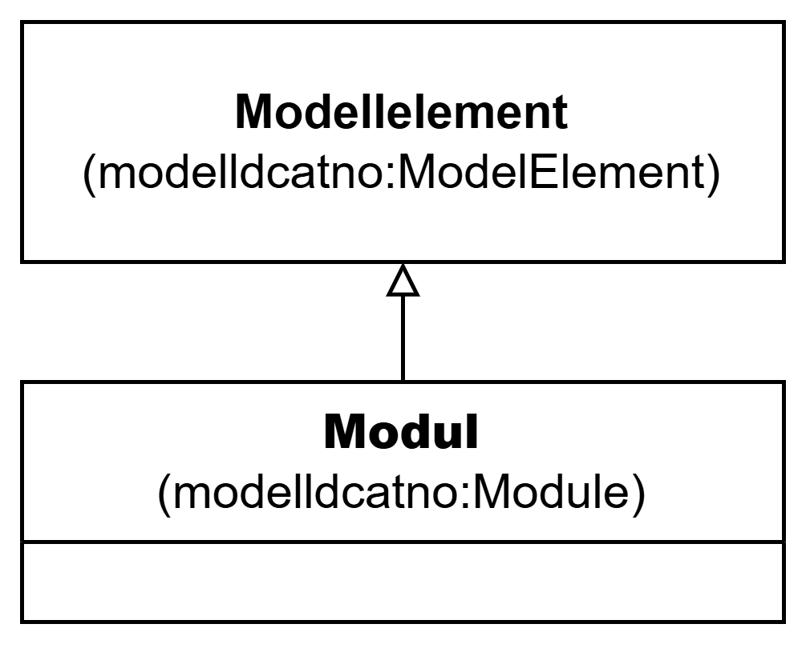

=== Klassen Modul (modelldcatno:Module) [[Modul]]

[[img-KlassenModul]]
.Klassen Modul (`modelldcatno:Module`)
[link=images/KlassenModul.png]

NOTE: Se <<Modellelement>> for egenskaper som SKAL/BØR/KAN brukes.

[cols="30s,70d"]
|===
| __English name__ | __Module__
| URI | `modelldcatno:Module`
| Subklasse av / __Subclass of__ | Modellelement (`modelldcatno:ModelElement`)
| Anvendelse / __Usage note__ | Klassen brukes til å representere en modellmodul/delmodell av modellen.

__This class is used to represent a module/submodel of the model.__
| Merknad / __Note__ | Modeller kan bestå av moduler, som beslektede modellelementer er gruppert under.

__Models can consist of modules, under which related model elements are grouped.__
|===
