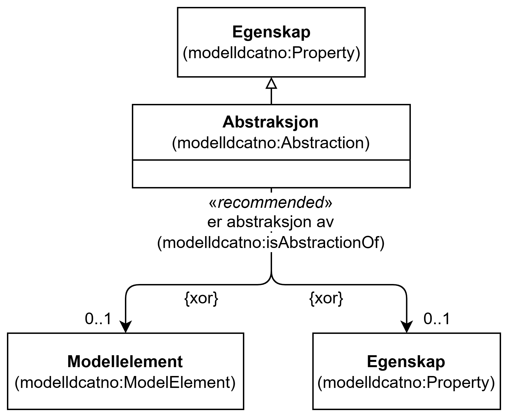

=== Klassen Abstraksjon (`modelldcatno:Abstraction`) [[Abstraksjon]]

[[img-KlassenAbstraksjon]]
.Klassen Abstraksjon (`modelldcatno:Abstraction`) og klassene den refererer til
[link=images/KlassenAbstraksjon.png]

NOTE: Se <<Egenskap>> for egenskaper som SKAL/BØR/KAN brukes, i tillegg til egenskapen(e) spesifisert her for denne klassen.

[cols="30s,70d"]
|===
| __English name__ | __Abstraction__
| URI | `modelldcatno:Abstraction`
| Subklasse av / __Subclass of__ | Egenskap (`modelldcatno:Property`)
| Anvendelse / __Usage note__ | Klassen brukes til å representere en abstraksjon.

__This class is used to represent an abstraction.__
|===

==== Anbefalte egenskaper for klassen __Abstraksjon__ [[Abstraksjon-anbefalte-egenskaper]]

===== Abstraksjon – er abstraksjon av (`modelldcatno:isAbstractionOf`) [[Abstraksjon-er-abstraksjon-av]]

[cols="30s,70d"]
|===
| __English name__ | __is abstraction of__
| URI | `modelldcatno:isAbstractionOf`
| Subegenskap av / __Subproperty of__ | `modelldcatno:hasType`
| Verdiområde / __Range__ | `modelldcatno:ModelElement` or `modelldcatno:Property`
| Anvendelse / __Usage note__ | Egenskapen brukes til å referere til modellelementet/egenskapen som denne egenskapen er en abstraksjon av.

__This property is used to refer to the model element or property that the current property is an abstraction of.__
| Multiplisitet / __Multiplicity__ | `0..1`
| Kravnivå / __Requirement level__ | Anbefalt / __Recommended__
|===

