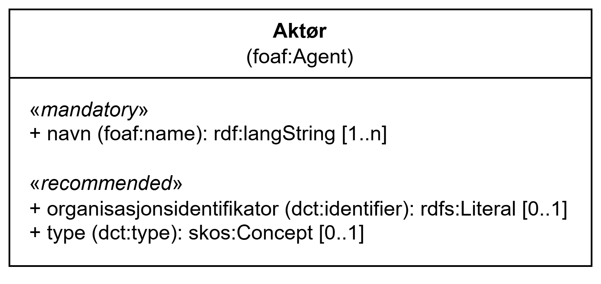

=== Klassen Aktør (`foaf:Agent`) [[Aktør]]

[[img-KlassenAktør]]
.Klassen Aktør (`foaf:Agent`)
[link=images/KlassenAktør.png]

[cols="30s,70d"]
|===
| __English name__ | __Agent__
| URI | `foaf:Agent`
| Anvendelse / __Usage note__ | Klassen brukes til å representere en aktør.

__This class is used to represent an agent.__
|===

==== Obligatoriske egenskaper for klassen __Aktør__ [[Aktør-obligatoriske-egenskaper]]

===== Aktør – navn (`foaf:name`) [[Aktør-navn]]

[cols="30s,70d"]
|===
| __English name__ | __name__
| URI | `foaf:name`
| Verdiområde / __Range__ | `rdf:langString`
| Anvendelse / __Usage note__ | Egenskapen brukes til å angi navnet til aktøren. Egenskapen bør gjentas for ulike versjoner av navnet (som navnet på forskjellige språk).

__This property is used to specify the name of the agent. This property should be repeated for different versions of the name (e.g., the name in different languages).__
| Multiplisitet / __Multiplicity__ | `1..n`
| Kravnivå / __Requirement level__ | Obligatorisk / __Mandatory__
|===

==== Anbefalte egenskaper for klassen __Aktør__ [[Aktør-anbefalte-egenskaper]]

===== Aktør – organisasjonsidentifikator (`dct:identifier`) [[Aktør-organisasjonsidentifikator]]

[cols="30s,70d"]
|===
| __English name__ | __identifier__
| URI | `dct:identifier`
| Verdiområde / __Range__ | `rdfs:Literal`
| Anvendelse / __Usage note__ | Egenskapen brukes til å angi organisasjonens identifikasjonsnummer, for eksempel i henhold til Enhetsregisterets organisasjonsnummer.

__This property is used to specify the identifier for the organization.__
| Multiplisitet / __Multiplicity__ | `0..1`
| Kravnivå / __Requirement level__ | Anbefalt / __Recommended__
|===

===== Aktør – type (`dct:type`) [[Aktør-type]]

[cols="30s,70d"]
|===
| __English name__ | __type__
| URI | `dct:type`
| Verdiområde / __Range__ | `skos:Concept`
| Anvendelse / __Usage note__ | Egenskapen brukes til å angi typen aktør tilhører.

__This property is used to specify the type that the agent belongs to.__
| Multiplisitet / __Multiplicity__ | `0..1`
| Kravnivå / __Requirement level__ | Anbefalt / __Recommended__
| Merknad / _Note_| Verdien SKAL velges fra http://purl.org/adms/publishertype/[ADMS Publisher Type Vocabulary (lenket ressurs i RDF) &#x29C9;, window="_blank", role="ext-link"].

__The value MUST be chosen from http://purl.org/adms/publishertype/[ADMS Publisher Type Vocabulary (linked resource in RDF) &#x29C9;, window="_blank", role="ext-link"].__
|===
