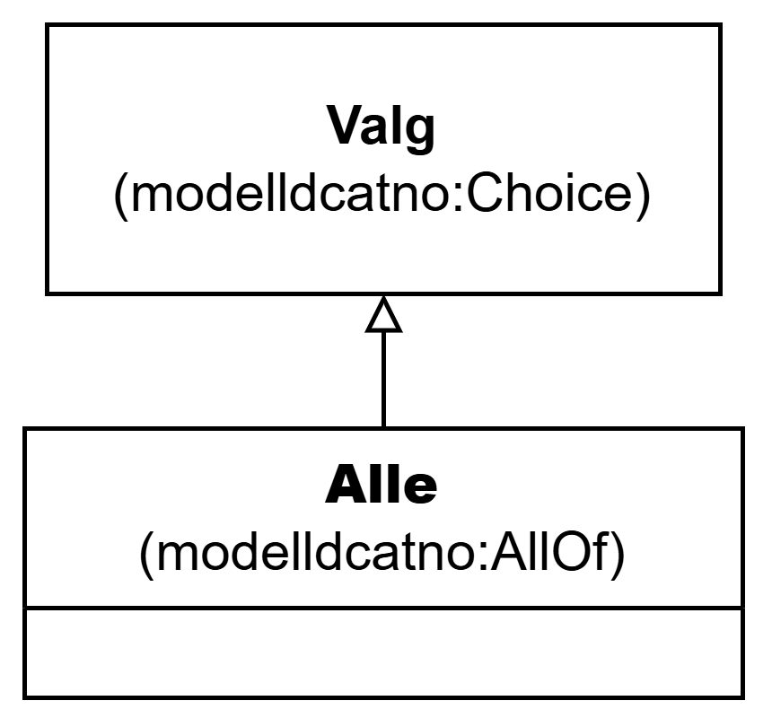

=== Klassen Alle (`modelldcatno:AllOf`) [[Alle]]

[[img-KlassenAlle]]
.Klassen Alle (`modelldcatno:AllOf`)
[link=images/KlassenAlle.png]

[cols="30s,70d"]
|===
| __English name__ | __All of__
| URI | `modelldcatno:AllOf`
| Subklasse av / __Subclass of__ | Valg (`modelldcatno:Choice`)
| Anvendelse / __Usage note__ | Klassen brukes til å representere valg som uttrykker at alle valgbare modellelementer og/eller egenskaper må velges samtidig.

__This class is used to represent a choice that expresses that all selectable model elements and/or properties must be selected simultaneously.__
|===
