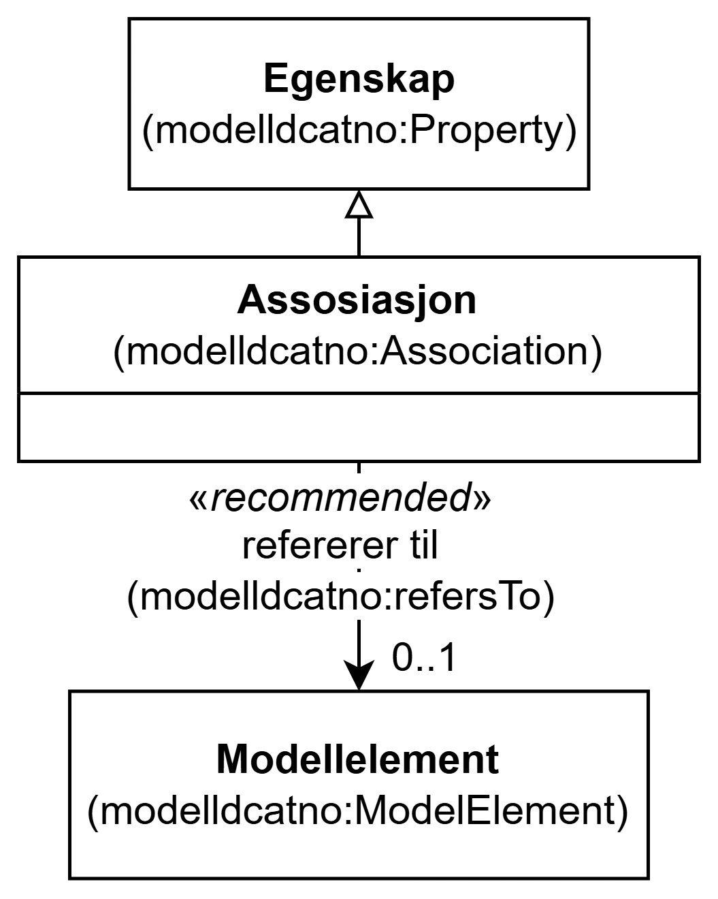

=== Klassen Assosiasjon (`modelldcatno:Association`) [[Assosiasjon]]

[[img-KlassenAssosiasjon]]
.Klassen Assosiasjon (`modelldcatno:Association`)
[link=images/KlassenAssosiasjon.png]

[cols="30s,70d"]
|===
| __English name__ | __Association__
| URI | `modelldcatno:Association`
| Subklasse av / __Subclass of__ | Egenskap (`modelldcatno:Property`)
| Anvendelse / __Usage note__ | Klassen brukes til å representere en assosiasjon.

__This class is used to represent an association.__
|===

==== Anbefalte egenskaper for klassen __Assosiasjon__ [[Assosiasjon-anbefalte-egenskaper]]

===== Assosiasjon – refererer til (`modelldcatno:refersTo`) [[Assosiasjon-refererer-til]]

[cols="30s,70d"]
|===
| __English name__ | __refers to__
| URI | `modelldcatno:refersTo`
| Subegenskap av / __Subproperty of__ | `modelldcatno:hasType`
| Verdiområde / __Range__ | `modelldcatno:ModelElement`
| Anvendelse / __Usage note__ | Egenskapen brukes til å referere til et modellelement som assosiasjonen peker til.

__This property is used to refer to a model element that the association refers to.__
| Multiplisitet / __Multiplicity__ | `0..1`
| Kravnivå / __Requirement level__ | Anbefalt / __Recommended__
|===

