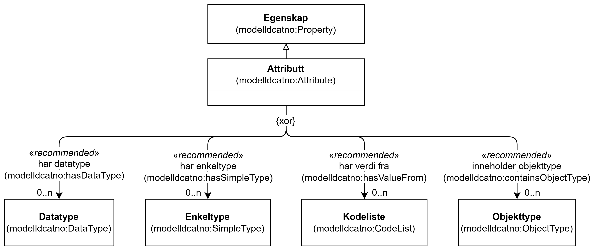

=== Klassen Attributt (`modelldcatno:Attribute`) [[Attributt]]

[[img-KlassenAttributt]]
.Klassen Attributt (`modelldcatno:Attribute`)
[link=images/KlassenAttributt.png]

NOTE: Se <<Egenskap>> for egenskaper som SKAL/BØR/KAN brukes, i tillegg til egenskapen(e) spesifisert her for denne klassen.

NOTE: Egenskapene til modelldcatno:Attribute er gjensidig utelukkende, dvs. at de ikke kan forekomme samtidig.

[cols="30s,70d"]
|===
| __English name__ | __Attribute__
| URI | `modelldcatno:Attribute`
| Subklasse av / __Subclass of__ | Egenskap (`modelldcatno:Property`)
| Anvendelse / __Usage note__ | Klassen brukes til å representere et attributt.

__This class is used to represent an attribute.__
|===

==== Anbefalte egenskaper for klassen __Attributt__ [[Attributt-anbefalte-egenskaper]]

===== Attributt – har datatype (`modelldcatno:hasDataType`) [[Attributt-har-datatype]]

[cols="30s,70d"]
|===
| __English name__ | __has data type__
| URI | `modelldcatno:hasDataType`
| Subegenskap av / __Subproperty of__ | `modelldcatno:hasType`
| Verdiområde / __Range__ | `modelldcatno:DataType`
| Anvendelse / __Usage note__ | Egenskapen brukes til å angi at attributtet har en datatype som type.

__This property is used to specify that the attribute has a data type as its type.__
| Multiplisitet / __Multiplicity__ | `0..n`
| Kravnivå / __Requirement level__ | Anbefalt / __Recommended__
|===

===== Attributt – har enkeltype (`modelldcatno:hasSimpleType`) [[Attributt-har-enkeltype]]

[cols="30s,70d"]
|===
| __English name__ | __has simple type__
| URI | `modelldcatno:hasSimpleType`
| Subegenskap av / __Subproperty of__ | `modelldcatno:hasType`
| Verdiområde / __Range__ | `modelldcatno:SimpleType`
| Anvendelse / __Usage note__ | Egenskapen brukes til å angi at attributtet har en enkeltype som type.

__This property is used to specify that the attribute has a simple type as its type.__
| Multiplisitet / __Multiplicity__ | `0..n`
| Kravnivå / __Requirement level__ | Anbefalt / __Recommended__
|===

===== Attributt – har verdi fra (`modelldcatno:hasValueFrom`) [[Attributt-har-verdi-fra]]

[cols="30s,70d"]
|===
| __English name__ | __has value from__
| URI | `modelldcatno:hasValueFrom`
| Subegenskap av / __Subproperty of__ | `modelldcatno:hasType`
| Verdiområde / __Range__ | `modelldcatno:CodeList`
| Anvendelse / __Usage note__ | Egenskapen brukes til å angi at attributtet har en kodeliste som type.

__This property is used to specify that the attribute has a code list as its type.__
| Multiplisitet / __Multiplicity__ | `0..n`
| Kravnivå / __Requirement level__ | Anbefalt / __Recommended__
|===

===== Attributt – inneholder objekttype (`modelldcatno:containsObjectType`) [[Attributt-inneholder-objekttype]]

[cols="30s,70d"]
|===
| __English name__ | __contains object type__
| URI | `modelldcatno:containsObjectType`
| Subegenskap av / __Subproperty of__ | `modelldcatno:hasType`
| Verdiområde / __Range__ | `modelldcatno:ObjectType`
| Anvendelse / __Usage note__ | Egenskapen brukes til å angi at attributtet har en objekttype som type.

__This property is used to specify that the attribute has an object type as its type.__
| Multiplisitet / __Multiplicity__ | `0..n`
| Kravnivå / __Requirement level__ | Anbefalt / __Recommended__
|===

