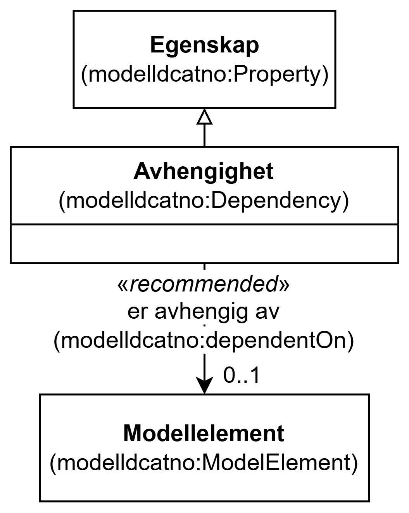

=== Klassen Avhengighet (`modelldcatno:Dependency`) [[Avhengighet]]

[[img-KlassenAvhengighet]]
.Klassen Avhengighet (`modelldcatno:Dependency`)
[link=images/KlassenAvhengighet.png]

[cols="30s,70d"]
|===
| __English name__ | __Dependency__
| URI | `modelldcatno:Dependency`
| Subklasse av / __Subclass of__ | Egenskap (`modelldcatno:Property`)
| Anvendelse / __Usage note__ | Klassen brukes til å representere en avhengighet.

__This class is used to represent a dependency.__
|===

==== Anbefalte egenskaper for klassen __Avhengighet__ [[Avhengighet-anbefalte-egenskaper]]

===== Avhengighet – er avhengig av (`modelldcatno:dependentOn`) [[Avhengighet-er-avhengig-av]]

[cols="30s,70d"]
|===
| __English name__ | __dependent on__
| URI | `modelldcatno:dependentOn`
| Verdiområde / __Range__ | `modelldcatno:ModelElement`
| Anvendelse / __Usage note__ | Egenskapen brukes til å referere til modellelementet som dette modellelementet er avhengig av.

__This property is used to refer to the model element that this model element is dependent on.__
| Multiplisitet / __Multiplicity__ | `0..1`
| Kravnivå / __Requirement level__ | Anbefalt / __Recommended__
|===

