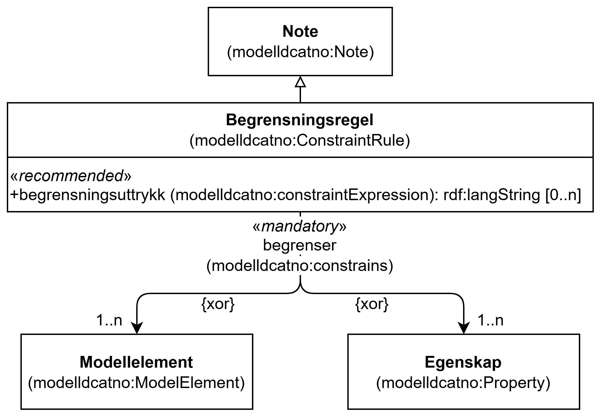

=== Klassen Begrensningsregel (`modelldcatno:ConstraintRule`) [[Begrensningsregel]]

[[img-KlassenBegrensningsregel]]
.Klassen Begrensningsregel (`modelldcatno:ConstraintRule`)
[link=images/KlassenBegrensningsregel.png]

NOTE: Se <<Note>> for egenskaper som SKAL/BØR/KAN brukes, i tillegg til egenskapen(e) spesifisert her for denne klassen.

[cols="30s,70d"]
|===
| __English name__ | __Constraint Rule__
| URI | `modelldcatno:ConstraintRule`
| Subklasse av / __Subclass of__ | Note (modelldcatno:Note)
| Anvendelse / __Usage note__ | Klassen brukes til å representere en begrensningsregel.

__This class is used to represent a constraint rule.__
|===

==== Obligatoriske egenskaper for klassen __Begrensningsregel__ [[Begrensningsregel-obligatoriske-egenskaper]]

===== Begrensningsregel – begrenser (`modelldcatno:constrains`) [[Begrensningsregel-begrenser]]

[cols="30s,70d"]
|===
| __English name__ | __constrains__
| URI | `modelldcatno:constrains`
| Subegenskap av / __Subproperty of__ | `modelldcatno:annotates`
| Verdiområde / __Range__ | `modelldcatno:Property`
| Anvendelse / __Usage note__ | Egenskapen brukes til å referere til egenskap eller modellelement som begrensningsregelen gjelder for.

__This property is used to refer to the property or model element that the constraint rule applies to.__
| Multiplisitet / __Multiplicity__ | `1..n`
| Kravnivå / __Requirement level__ | Obligatorisk / __Mandatory__
|===

==== Anbefalte egenskaper for klassen __Begrensningsregel__ [[Begrensningsregel-anbefalte-egenskaper]]

===== Begrensningsregel – begrensningsuttrykk (`modelldcatno:constraintExpression`) [[Begrensningsregel-begrensningsuttrykk]]

[cols="30s,70d"]
|===
| __English name__ | __constraint expression__
| URI | `modelldcatno:constraintExpression`
| Verdiområde / __Range__ | `rdf:langString`
| Anvendelse / __Usage note__ | Egenskapen brukes til å angi Uttrykk som beskriver en begrensningsregel. Egenskapen bør gjentas når uttrykket finnes i flere ulike språk.

__This property is used to specify the constraint expression_ It should be repeated when the expression exists in multiple languages.__
| Multiplisitet / __Multiplicity__ | `0..n`
| Kravnivå / __Requirement level__ | Anbefalt / __Recommended__
|===
