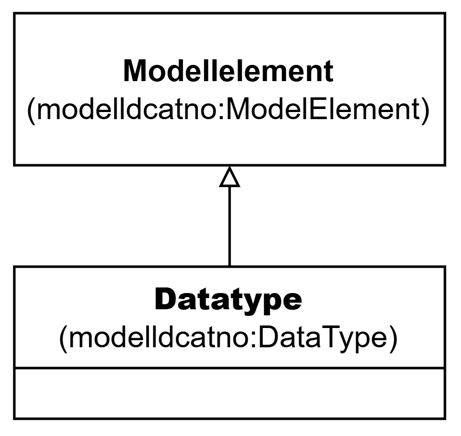

=== Klassen Datatype (`modelldcatno:DataType`) [[Datatype]]

[[img-KlassenDatatype]]
.Klassen Datatype (`modelldcatno:DataType`)
[link=images/KlassenDatatype.png]

NOTE: Se <<Modellelement>> for egenskaper som SKAL/BØR/KAN brukes.

[cols="30s,70d"]
|===
| __English name__ | __Data type__
| URI | `modelldcatno:DataType`
| Subklasse av / __Subclass of__ | Modellelement `modelldcatno:ModelElement`
| Anvendelse / __Usage note__ | Klassen brukes til å representere en datatype (en sammensatt verdistruktur uten identitet).

__This class is used to represent a data type.__
|===

