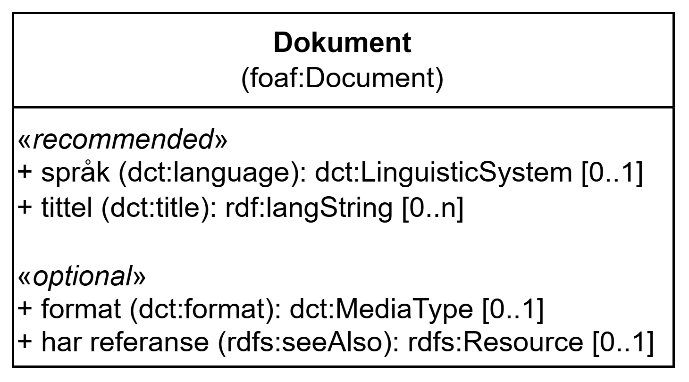

=== Klassen Dokument (`foaf:Document`) [[Dokument]]

[[img-KlassenDokument]]
.Klassen Dokument (`foaf:Document`) og klassene den refererer til
[link=images/KlassenDokument.png]

[cols="30s,70d"]
|===
| __English name__ | __Document__
| URI | `foaf:Document`
| Anvendelse / __Usage note__ | Klassen brukes til å representere et dokument.

__This class is used to represent a document.__
|===

==== Anbefalte egenskaper for klassen __Dokument__ [[Dokument-anbefalte-egenskaper]]

===== Dokument – språk (`dct:language`) [[Dokument-språk]]

[cols="30s,70d"]
|===
| __English name__ | __language__
| URI | `dct:language`
| Verdiområde / __Range__ | `dct:LinguisticSystem`
| Anvendelse / __Usage note__ | Egenskapen brukes til å referere til språket som dokumentet er i.

__This property is used to refer to the language of the document.__
| Multiplisitet / __Multiplicity__ | `0..1`
| Kravnivå / __Requirement level__ | Anbefalt / __Recommended__
| Merknad / _Note_ | Verdien SKAL velges fra EU's kontrollerte vokabular https://op.europa.eu/en/web/eu-vocabularies/concept-scheme/-/resource?uri=http://publications.europa.eu/resource/authority/language[__Language__ &#x29C9;, window="_blank", role="ext-link"].

__The value MUST be chosen from EU's controlled vocabulary https://op.europa.eu/en/web/eu-vocabularies/concept-scheme/-/resource?uri=http://publications.europa.eu/resource/authority/language[Language &#x29C9;, window="_blank", role="ext-link"].__
|===

Eksempel i RDF Turtle:
-----
<aFigure> a dct:Document ; 
   dct:language <http://publications.europa.eu/resource/authority/language/NOB> ; 
   .
-----

===== Dokument – tittel (`dct:title`) [[Dokument-tittel]]

[cols="30s,70d"]
|===
| __English name__ | __title__
| URI | `dct:title`
| Verdiområde / __Range__ | `rdf:langString`
| Anvendelse / __Usage note__ | Egenskapen brukes til å angi tittel for dokumentet. Egenskapen bør gjentas når tittelen finnes i flere ulike språk.

__This property is used to specify the title for the document. It should be repeated when the title exists in multiple languages.__
| Multiplisitet / __Multiplicity__ | `0..n`
| Kravnivå / __Requirement level__ | Anbefalt / __Recommended__
|===

==== Valgfrie egenskaper for klassen __Dokument__ [[Dokument-valgfrie-egenskaper]]

===== Dokument – format (`dct:format`) [[Dokument-format]]

[cols="30s,70d"]
|===
| __English name__ | __format__
| URI | `dct:format`
| Verdiområde / __Range__ | `dct:MediaType`
| Anvendelse / __Usage note__ | Egenskapen brukes til å angi dokumentets filformat. Brukes til å angi hvilket format en alternativ representasjon av modellen er på.

__This property is used to specify the format of the document. It is used to indicate what format an alternative representation of the model is in.__
| Multiplisitet / __Multiplicity__ | `0..1`
| Kravnivå / __Requirement level__ | Valgfri / __Optional__
| Merknad / __Note__ | Verdien SKAL velges fra EU's kontrollerte vokabular https://op.europa.eu/en/web/eu-vocabularies/concept-scheme/-/resource?uri=http://publications.europa.eu/resource/authority/file-type[__File type__ &#x29C9;, window="_blank", role="ext-link"].

__The value MUST be chosen from EU's controlled vocabulary https://op.europa.eu/en/web/eu-vocabularies/concept-scheme/-/resource?uri=http://publications.europa.eu/resource/authority/file-type[File type &#x29C9;, window="_blank", role="ext-link"].__
| Eksempel / _Example_ | https://op.europa.eu/en/web/eu-vocabularies/concept/-/resource?uri=http://publications.europa.eu/resource/authority/file-type/RDF_TURTLE[RDF Turtle &#x29C9;, window="_blank", role="ext-link"]
|===

Eksempel i RDF Turtle:
-----
<aFigure> a dct:Document ; 
   dct:format <http://publications.europa.eu/resource/authority/file-type/PNG> ; 
   .
-----

===== Dokument – har referanse (`rdfs:seeAlso`) [[Dokument-har-referanse]]

[cols="30s,70d"]
|===
| __English name__ | __has reference__
| URI | `rdfs:seeAlso`
| Verdiområde / __Range__ | `rdfs:Resource`
| Anvendelse / __Usage note__ | Egenskapen brukes til å angi referansen til dokumentet.

__This property is used to specify the reference to the document.__
| Multiplisitet / __Multiplicity__ | `0..1`
| Kravnivå / __Requirement level__ | Valgfri / __Optional__
|===
