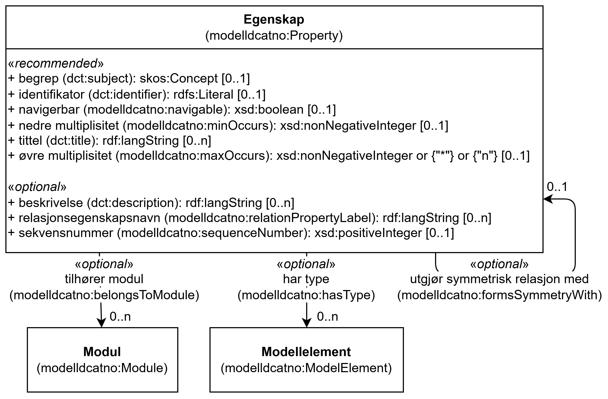

=== Klassen Egenskap (`modelldcatno:Property`) [[Egenskap]]

[[img-KlassenEgenskap]]
.Klassen Egenskap (`modelldcatno:Property`)
[link=images/KlassenEgenskap.png]

[cols="30s,70d"]
|===
| __English name__ | __Property__
| URI | `modelldcatno:Property`
| Anvendelse / __Usage note__ | Klassen brukes til å representere en egenskap.

__This class is used to represent a property.__
|===

==== Anbefalte egenskaper for klassen __Egenskap__ [[Egenskap-anbefalte-egenskaper]]

===== Egenskap – begrep (`dct:subject`) [[Egenskap-begrep]]

[cols="30s,70d"]
|===
| __English name__ | __subject__
| URI | `dct:subject`
| Verdiområde / __Range__ | `skos:Concept`
| Anvendelse / __Usage note__ | Egenskapen brukes til å referere til begrep som er viktig for å forstå og tolke egenskapen.

__This property is used to refer to a concept that is important for understanding and interpreting the property.__
| Multiplisitet / __Multiplicity__ | `0..1`
| Kravnivå / __Requirement level__ | Anbefalt / __Recommended__
|===

===== Egenskap – identifikator (`dct:identifier`) [[Egenskap-identifikator]]

[cols="30s,70d"]
|===
| __English name__ | __identifier__
| URI | `dct:identifier`
| Verdiområde / __Range__ | `rdfs:Literal`
| Anvendelse / __Usage note__ | Egenskapen brukes til å angi en unik og persistent identifikator til egenskapen.

__This property is used to specify a unique and persistent identifier for the property.__
| Multiplisitet / __Multiplicity__ | `0..1`
| Kravnivå / __Requirement level__ | Anbefalt / __Recommended__
|===

===== Egenskap – navigerbar (`modelldcatno:navigable`) [[Egenskap-navigerbar]]

[cols="30s,70d"]
|===
| __English name__ | __navigable__
| URI | `modelldcatno:navigable`
| Verdiområde / __Range__ | `xsd:boolean`
| Anvendelse / __Usage note__ | Egenskapen brukes til å angi om egenskapen er navigerbar eller ikke.

__This property is used to specify if the property is navigable.__
| Multiplisitet / __Multiplicity__ | `0..1`
| Kravnivå / __Requirement level__ | Anbefalt / __Recommended__
|===

===== Egenskap – nedre multiplisitet (`modelldcatno:minOccurs`) [[Egenskap-nedre-multiplisitet]]

[cols="30s,70d"]
|===
| __English name__ | __min occurs__
| URI | `modelldcatno:minOccurs`
| Verdiområde / __Range__ | `xsd:nonNegativeInteger`
| Anvendelse / __Usage note__ | Egenskapen brukes til å angi det minste antallet lovlige forekomster egenskapen kan ha.

__This property is used to specify the minimum number of occurrences of the property.__
| Multiplisitet / __Multiplicity__ | `0..1`
| Kravnivå / __Requirement level__ | Anbefalt / __Recommended__
|===

===== Egenskap – tittel (`dct:title`) [[Egenskap-tittel]]

[cols="30s,70d"]
|===
| __English name__ | __title__
| URI | `dct:title`
| Verdiområde / __Range__ | `rdf:langString`
| Anvendelse / __Usage note__ | Egenskapen brukes til å angi navnet på egenskapen. Egenskapen bør gjentas når navnet finnes i flere ulike språk.

__This property is used to specify the name of the property. The property should be repeated when the name exists in multiple languages.__
| Multiplisitet / __Multiplicity__ | `0..n`
| Kravnivå / __Requirement level__ | Anbefalt / __Recommended__
|===

===== Egenskap – øvre multiplisitet (`modelldcatno:maxOccurs`) [[Egenskap-øvre-multiplisitet]]

[cols="30s,70d"]
|===
| __English name__ | __max occurs__
| URI | `modelldcatno:maxOccurs`
| Verdiområde / __Range__ | `xsd:nonNegativeInteger` or `{"*"}` or `{"n"}`
| Anvendelse / __Usage note__ | Egenskapen brukes til å angi det største antallet lovlige forekomster egenskapen kan ha.

__This property is used to specify the maximum number of occurrences of the property.__
| Multiplisitet / __Multiplicity__ | `0..1`
| Kravnivå / __Requirement level__ | Anbefalt / __Recommended__
|===

==== Valgfrie egenskaper for klassen __Egenskap__ [[Egenskap-valgfrie-egenskaper]]

===== Egenskap – beskrivelse (`dct:description`) [[Egenskap-beskrivelse]]

[cols="30s,70d"]
|===
| __English name__ | __description__
| URI | `dct:description`
| Verdiområde / __Range__ | `rdf:langString`
| Anvendelse / __Usage note__ | Egenskapen brukes til å angi tekstlig beskrivelse av egenskapen. Egenskapen bør gjentas når beskrivelsen finnes i flere ulike språk.

__This property is used to specify a textual description of the property. The property should be repeated when the description exists in multiple languages.__
| Multiplisitet / __Multiplicity__ | `0..n`
| Kravnivå / __Requirement level__ | Valgfri / __Optional__
|===

===== Egenskap – har type (`modelldcatno:hasType`) [[Egenskap-har-type]]

[cols="30s,70d"]
|===
| __English name__ | __has type__
| URI | `modelldcatno:hasType`
| Verdiområde / __Range__ | `modelldcatno:ModelElement`
| Anvendelse / __Usage note__ | Egenskapen brukes til å angi en generell beskrivelse av verdidomenet til egenskapen.

__This property is used to specify a general description of the property's value domain.__
| Multiplisitet / __Multiplicity__ | `0..n`
| Kravnivå / __Requirement level__ | Valgfri / __Optional__
|===

===== Egenskap – relasjonsegenskapsnavn (`modelldcatno:relationPropertyLabel`) [[Egenskap-relasjonsegenskapsnavn]]

[cols="30s,70d"]
|===
| __English name__ | __relation property label__
| URI | `modelldcatno:relationPropertyLabel`
| Verdiområde / __Range__ | `rdf:langString`
| Anvendelse / __Usage note__ | Egenskapen brukes til å angi navn på relasjon mellom to egenskaper. Brukes i kombinasjon med egenskapen «utgjør symmetrisk relasjon med» (modelldcatno:formsSymmetryWith). Egenskapen bør gjentas når navnet finnes i flere ulike språk/målformer.

__This property is used to specify the name of the relation between two properties. It is used in combination with the property "forms symmetry with" (modelldcatno:formsSymmetryWith). The property should be repeated when the name exists in multiple languages.__
| Multiplisitet / __Multiplicity__ | `0..n`
| Kravnivå / __Requirement level__ | Valgfri / __Optional__
|===

===== Egenskap – sekvensnummer (`modelldcatno:sequenceNumber`) [[Egenskap-sekvensnummer]]

[cols="30s,70d"]
|===
| __English name__ | __sequence number__
| URI | `modelldcatno:sequenceNumber`
| Verdiområde / __Range__ | `xsd:positiveInteger`
| Anvendelse / __Usage note__ | Egenskapen brukes til å angi en numerisk, sekvensielt stigende verdi som kan brukes til å identifisere og holde orden på rekkefølgen på egenskapene til et modellelement. For enkelte modeller er egenskapenes orden vesentlig, f.eks. slik det ofte er i XML.

__This property is used to specify a numeric, sequentially increasing value that can be used to identify and maintain the order of the properties of a model element. In some models, the order of the properties is significant, for example, as is often the case in XML.__
| Multiplisitet / __Multiplicity__ | `0..1`
| Kravnivå / __Requirement level__ | Valgfri / __Optional__
|===

===== Egenskap – tilhører modul (`modelldcatno:belongsToModule`) [[Egenskap-tilhører-modul]]

[cols="30s,70d"]
|===
| __English name__ | __belongs to module__
| URI | `modelldcatno:belongsToModule`
| Verdiområde / __Range__ | `modelldcatno:Module`
| Anvendelse / __Usage note__ | Egenskapen brukes til å referere til en modellmodul/delmodell som egenskapen inngår i.

__This property is used to refer to a module/submodol to which the property belongs.__
| Multiplisitet / __Multiplicity__ | `0..n`
| Kravnivå / __Requirement level__ | Valgfri / __Optional__
|===

===== Egenskap – utgjør symmetrisk relasjon med (`modelldcatno:formsSymmetryWith`) [[Egenskap-utgjør-symmetrisk-relasjon-med]]

[cols="30s,70d"]
|===
| __English name__ | __forms symmetry with__
| URI | `modelldcatno:formsSymmetryWith`
| Verdiområde / __Range__ | `modelldcatno:Property`
| Anvendelse / __Usage note__ | Egenskapen brukes til å uttrykke at egenskapen har en symmetrisk relasjon til en annen egenskap.

__This property is used to express that the property has a symmetric relation to another property.__
| Multiplisitet / __Multiplicity__ | `0..1`
| Kravnivå / __Requirement level__ | Valgfri / __Optional__
|===

