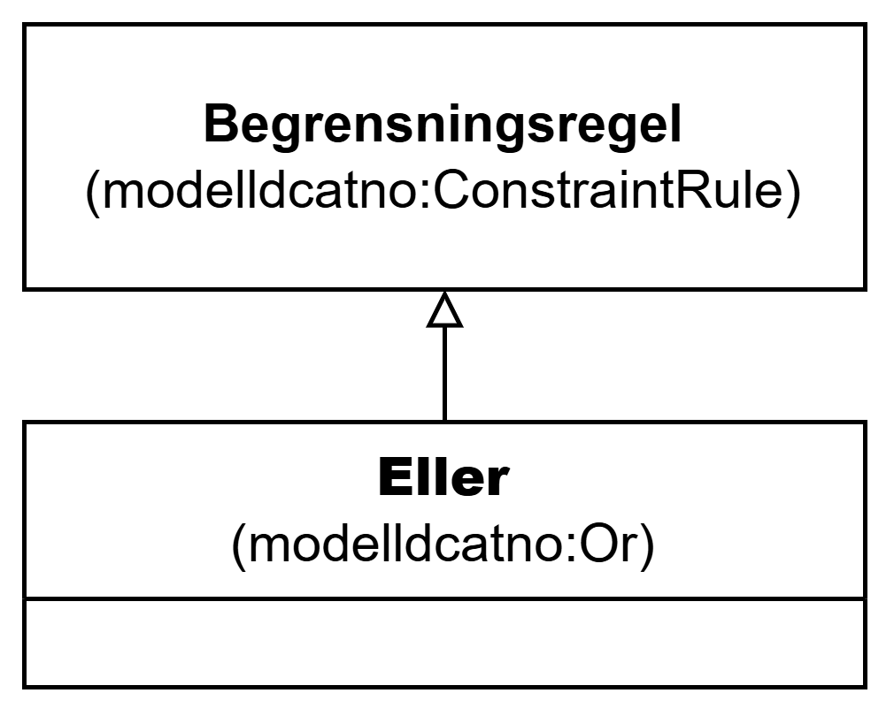

=== Klassen Eller (`modelldcatno:Or`) [[Eller]]

[[img-KlassenEller]]
.Klassen Eller (`modelldcatno:Or`)
[link=images/KlassenEller.png]

[cols="30s,70d"]
|===
| __English name__ | __Or__
| URI | `modelldcatno:Or`
| Subklasse av / __Subclass of__ | Begrensningsregel (`modelldcatno:ConstraintRule`)
| Anvendelse / __Usage note__ | Klassen brukes til å representere en begrensningsregel som uttrykker at som minimum må én av egenskapene og/eller modellelementene som den refererer til forekomme (inklusiv eller).

__This class is used to represent a constraint rule that expresses that at least one of the properties and/or model elements it refers to must occur (inclusive or).__
|===

