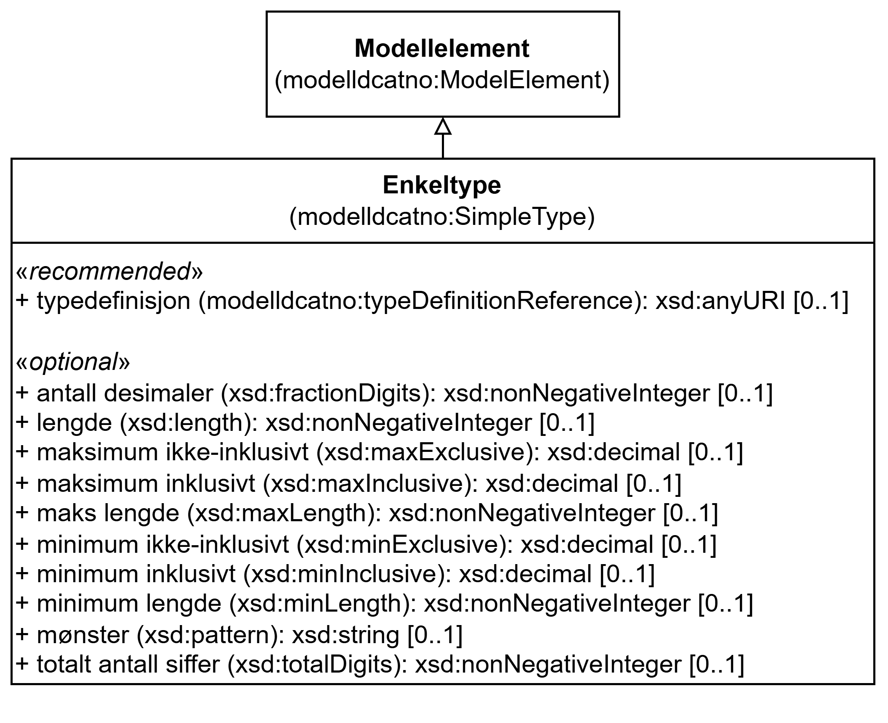

=== Klassen Enkeltype (`modelldcatno:SimpleType`) [[Enkeltype]]

[[img-KlassenEnkeltype]]
.Klassen Enkeltype (`modelldcatno:SimpleType`)
[link=images/KlassenEnkeltype.png]

NOTE: Se <<Modellelement>> for egenskaper som SKAL/BØR/KAN brukes, i tillegg til egenskapen(e) spesifisert her for denne klassen.

[cols="30s,70d"]
|===
| __English name__ | __Simple Type__
| URI | `modelldcatno:SimpleType`
| Subklasse av / __Subclass of__ | Modellelement (`modelldcatno:ModelElement`)
| Anvendelse / __Usage note__ | Klassen brukes til å beskrive enkeltype.

__This class is used to describe simple type.__
|===

==== Anbefalte egenskaper for klassen __Enkeltype__ [[Enkeltype-anbefalte-egenskaper]]

===== Enkeltype – typedefinisjon (`modelldcatno:typeDefinitionReference`) [[Enkeltype-typedefinisjon]]

[cols="30s,70d"]
|===
| __English name__ | __type definition reference__
| URI | `modelldcatno:typeDefinitionReference`
| Verdiområde / __Range__ | `xsd:anyURI`
| Anvendelse / __Usage note__ | Egenskapen brukes til å referere til en standard ontologi eller bibliotek for typer, f.eks. typer definert av W3C og UML.

__This property is used to refer to a standard ontology or library for types, e.g., types defined by W3C and UML.__
| Multiplisitet / __Multiplicity__ | `0..1`
| Kravnivå / __Requirement level__ | Anbefalt / __Recommended__
|===

==== Valgfrie egenskaper for klassen __Enkeltype__ [[Enkeltype-valgfrie-egenskaper]]

===== Enkeltype – antall desimaler (`xsd:fractionDigits`) [[Enkeltype-antall-desimaler]]

[cols="30s,70d"]
|===
| __English name__ | __fraction digits__
| URI | `xsd:fractionDigits`
| Verdiområde / __Range__ | `xsd:nonNegativeInteger`
| Anvendelse / __Usage note__ | Egenskapen brukes til å angi maksimalt antall tillatte desimaler.

__This property is used to specify the maximum number of allowed decimal places.__
| Multiplisitet / __Multiplicity__ | `0..1`
| Kravnivå / __Requirement level__ | Valgfri / __Optional__
|===

===== Enkeltype – lengde (`xsd:length`) [[Enkeltype-lengde]]

[cols="30s,70d"]
|===
| __English name__ | __length__
| URI | `xsd:length`
| Verdiområde / __Range__ | `xsd:nonNegativeInteger`
| Anvendelse / __Usage note__ | Egenskapen brukes til å angi lengde på en streng.

__This property is used to specify the length of a string.__
| Multiplisitet / __Multiplicity__ | `0..1`
| Kravnivå / __Requirement level__ | Valgfri / __Optional__
|===

===== Enkeltype – maks lengde (`xsd:maxLength`) [[Enkeltype-maks-lengde]]

[cols="30s,70d"]
|===
| __English name__ | __max length__
| URI | `xsd:maxLength`
| Verdiområde / __Range__ | `xsd:nonNegativeInteger`
| Anvendelse / __Usage note__ | Egenskapen brukes til å angi maksimum lengde på en streng.

__This property is used to specify the maximum length of a string.__
| Multiplisitet / __Multiplicity__ | `0..1`
| Kravnivå / __Requirement level__ | Valgfri / __Optional__
|===

===== Enkeltype – maksimum ikke-inklusivt (`xsd:maxExclusive`) [[Enkeltype-maksimum-ikke-inklusivt]]

[cols="30s,70d"]
|===
| __English name__ | __max exclusive__
| URI | `xsd:maxExclusive`
| Verdiområde / __Range__ | `xsd:decimal`
| Anvendelse / __Usage note__ | Egenskapen brukes til å angi den øvre grensene for en numerisk verdi (verdien må være mindre enn denne verdien).

__This property is used to specify the upper bound for a numeric value (the value must be less than this value).__
| Multiplisitet / __Multiplicity__ | `0..1`
| Kravnivå / __Requirement level__ | Valgfri / __Optional__
|===

===== Enkeltype – maksimum inklusivt (`xsd:maxInclusive`) [[Enkeltype-maksimum-inklusivt]]

[cols="30s,70d"]
|===
| __English name__ | __max inclusive__
| URI | `xsd:maxInclusive`
| Verdiområde / __Range__ | `xsd:decimal`
| Anvendelse / __Usage note__ | Egenskapen brukes til å angi den øvre grensen for en numerisk verdi (verdien må være mindre enn eller lik denne verdien).

__This property is used to specify the upper bound for a numeric value (the value must be less than or equal to this value).__
| Multiplisitet / __Multiplicity__ | `0..1`
| Kravnivå / __Requirement level__ | Valgfri / __Optional__
|===

===== Enkeltype – minimum ikke-inklusivt (`xsd:minExclusive`) [[Enkeltype-minimum-ikke-inklusivt]]

[cols="30s,70d"]
|===
| __English name__ | __min exclusive__
| URI | `xsd:minExclusive`
| Verdiområde / __Range__ | `xsd:decimal`
| Anvendelse / __Usage note__ | Egenskapen brukes til å angi den nedre grensene for en numerisk verdi (verdien må være større enn denne verdien).

__This property is used to specify the lower bound for a numeric value (the value must be greater than this value).__
| Multiplisitet / __Multiplicity__ | `0..1`
| Kravnivå / __Requirement level__ | Valgfri / __Optional__
|===

===== Enkeltype – minimum inklusivt (`xsd:minInclusive`) [[Enkeltype-minimum-inklusivt]]

[cols="30s,70d"]
|===
| __English name__ | __min inclusive__
| URI | `xsd:minInclusive`
| Verdiområde / __Range__ | `xsd:decimal`
| Anvendelse / __Usage note__ | Egenskapen brukes til å angi den nedre grensen for en numerisk verdi (verdien må være større enn eller lik denne verdien).

__This property is used to specify the lower bound for a numeric value (the value must be greater than or equal to this value).__
| Multiplisitet / __Multiplicity__ | `0..1`
| Kravnivå / __Requirement level__ | Valgfri / __Optional__
|===

===== Enkeltype – minimum lengde (`xsd:minLength`) [[Enkeltype-minimum-lengde]]

[cols="30s,70d"]
|===
| __English name__ | __min length__
| URI | `xsd:minLength`
| Verdiområde / __Range__ | `xsd:nonNegativeInteger`
| Anvendelse / __Usage note__ | Egenskapen brukes til å angi minimum lengde på en streng.

__This property is used to specify the minimum length of a string.__
| Multiplisitet / __Multiplicity__ | `0..1`
| Kravnivå / __Requirement level__ | Valgfri / __Optional__
|===

===== Enkeltype – mønster (`xsd:pattern`) [[Enkeltype-mønster]]

[cols="30s,70d"]
|===
| __English name__ | __pattern__
| URI | `xsd:pattern`
| Verdiområde / __Range__ | `xsd:string`
| Anvendelse / __Usage note__ | Egenskapen brukes til å angi et regulært uttrykk som beskriver gyldig syntaks for et dataelement.

__This property is used to specify a regular expression that describes the valid syntax for a data element.__
| Multiplisitet / __Multiplicity__ | `0..1`
| Kravnivå / __Requirement level__ | Valgfri / __Optional__
|===

===== Enkeltype – totalt antall siffer (`xsd:totalDigits`) [[Enkeltype-totalt-antall-siffer]]

[cols="30s,70d"]
|===
| __English name__ | __total digits__
| URI | `xsd:totalDigits`
| Verdiområde / __Range__ | `xsd:nonNegativeInteger`
| Anvendelse / __Usage note__ | Egenskapen brukes til å angi nøyaktig antall tillatte sifre. Det må være større enn null.

__This property is used to specify the exact number of allowed digits. It must be greater than zero.__
| Multiplisitet / __Multiplicity__ | `0..1`
| Kravnivå / __Requirement level__ | Valgfri / __Optional__
|===
