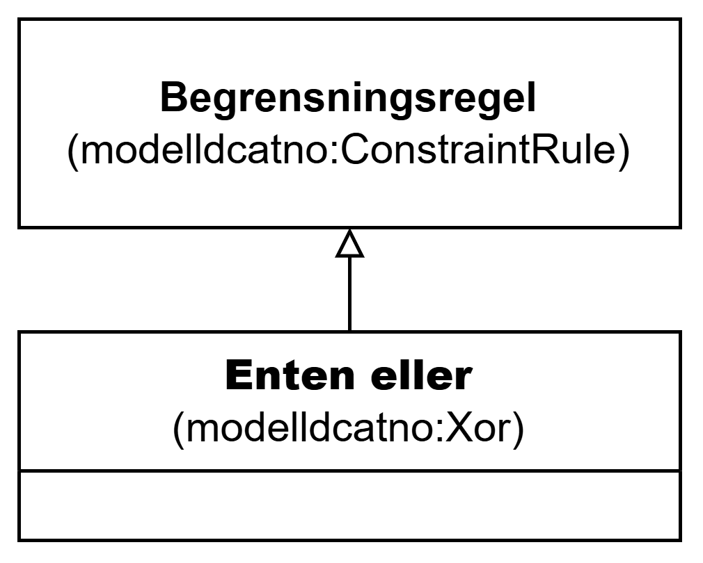

=== Klassen Enten eller (`modelldcatno:Xor`) [[EntenEller]]

[[img-KlassenEntenEller]]
.Klassen Enten eller (`modelldcatno:Xor`)
[link=images/KlassenEntenEller.png]

NOTE: Se <<Begrensningsregel>> for egenskaper som SKAL/BØR/KAN brukes.

[cols="30s,70d"]
|===
| __English name__ | __Xor__
| URI | `modelldcatno:Xor`
| Subklasse av / __Subclass of__ | Begrensningsregel (`modelldcatno:ConstraintRule`)
| Anvendelse / __Usage note__ | Klassen brukes til å representere en begrensningsregel som uttrykker at kun én av egenskapene eller modellelementene den refererer til kan opptre samtidig (eksklusiv eller)..

__This class is used to represent a constraint rule that expresses that only one of the properties or model elements it refers to can occur at a time (exclusive or).__
| Merknad / __Note__ | Som minimum må begrensningsregelen være knyttet til to egenskaper/modellelementer.

__At a minimum, the constraint rule must be linked to two properties/model elements.__
|===

