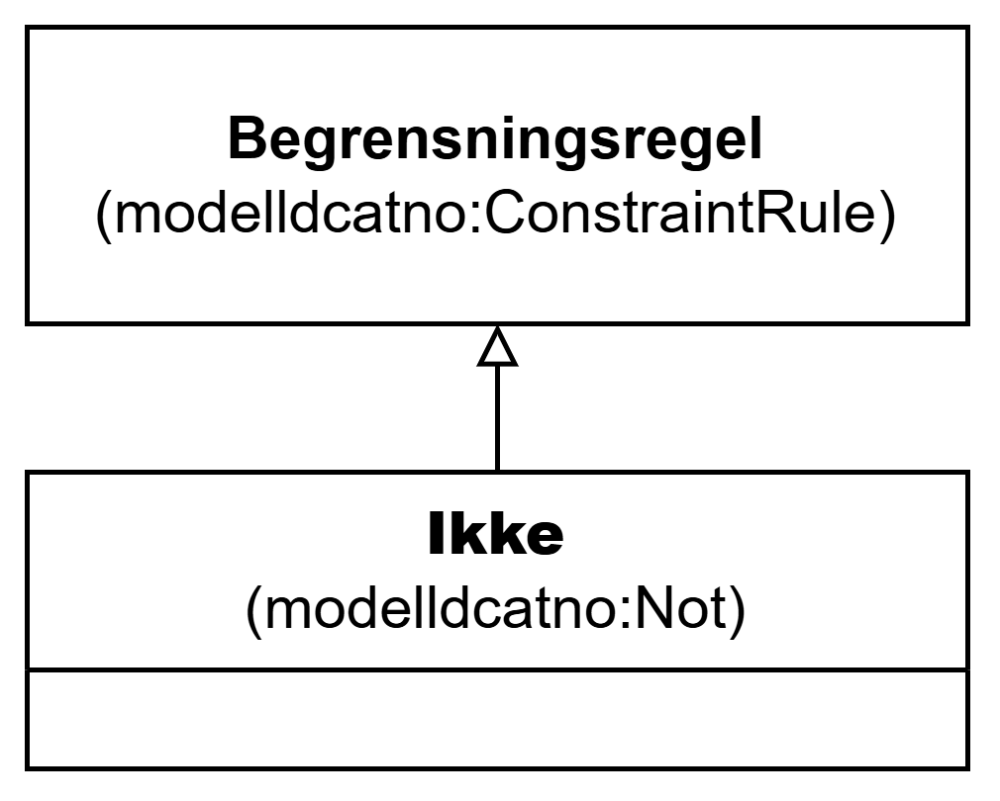

=== Klassen Ikke (`modelldcatno:Not`) [[Ikke]]

[[img-KlassenIkke]]
.Klassen Ikke (`modelldcatno:Not`)
[link=images/KlassenIkke.png]

[cols="30s,70d"]
|===
| __English name__ | __Not__
| URI | `modelldcatno:Not`
| Subklasse av / __Subclass of__ | Begrensningsregel (`modelldcatno:ConstraintRule`)
| Anvendelse / __Usage note__ | Klassen brukes til å representere begrensningsregel som uttrykker at kun instanser som ikke samsvarer med egenskaper og/eller modellelementer som den refererer til, kan forekomme.

__This class is used to represent a constraint rule that expresses that only instances that do not comply with the properties and/or model elements it refers to can occur.__
|===
