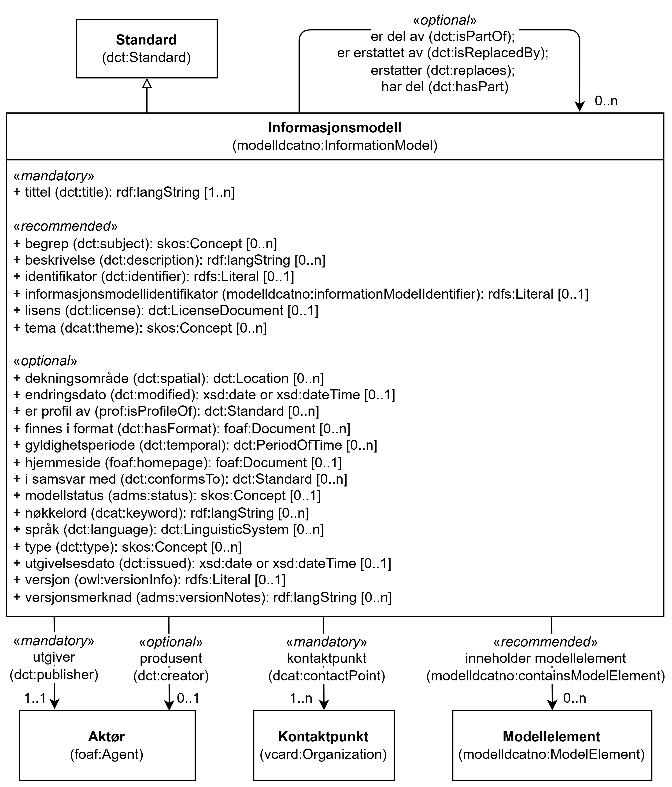

=== Klassen Informasjonsmodell (`modelldcatno:InformationModel`) [[Informasjonsmodell]]

[[img-KlassenInformasjonsmodell]]
.Klassen Informasjonsmodell (`modelldcatno:InformationModel`) og klassene den refererer til
[link=images/KlassenInformasjonsmodell.png]

[cols="30s,70d"]
|===
| __English name__ | __Information Model__
| URI | `modelldcatno:InformationModel`
| Subklasse av / __Subclass of__ | Standard (`dct:Standard`)
| Anvendelse / __Usage note__ | Klassen brukes til å representere en informasjonsmodell.

__This class is used to represent an information model.__
|===

==== Obligatoriske egenskaper for klassen __Informasjonsmodell__ [[Informasjonsmodell-obligatoriske-egenskaper]]

===== Informasjonsmodell – kontaktpunkt (`dcat:contactPoint`) [[Informasjonsmodell-kontaktpunkt]]

[cols="30s,70d"]
|===
| __English name__ | __contact point__
| URI | `dcat:contactPoint`
| Verdiområde / __Range__ | `vcard:Organization`
| Anvendelse / __Usage note__ | Egenskapen brukes til å angi kontaktpunkt med kontaktopplysninger, som kan brukes ved spørsmål om modellen.

__This property is used to specify contact point with contact information, which can be used to send comments or questions about the model.__
| Multiplisitet / __Multiplicity__ | `1..n`
| Kravnivå / __Requirement level__ | Obligatorisk / __Mandatory__
|===

===== Informasjonsmodell – tittel (`dct:title`) [[Informasjonsmodell-tittel]]

[cols="30s,70d"]
|===
| __English name__ | __title__
| URI | `dct:title`
| Verdiområde / __Range__ | `rdf:langString`
| Anvendelse / __Usage note__ | Egenskapen brukes til å angi navnet på modellen. Egenskapen bør gjentas når navnet finnes i flere ulike språk.

__This property is used to specify the title of the model. It should be repeated when the title exists in multiple languages.__
| Multiplisitet / __Multiplicity__ | `1..n`
| Kravnivå / __Requirement level__ | Obligatorisk / __Mandatory__
|===

===== Informasjonsmodell – utgiver (`dct:publisher`) [[Informasjonsmodell-utgiver]]

[cols="30s,70d"]
|===
| __English name__ | __publisher__
| URI | `dct:publisher`
| Verdiområde / __Range__ | `foaf:Agent`
| Anvendelse / __Usage note__ | Egenskapen brukes til å angi aktøren (virksomheten) som er ansvarlig for å gjøre modellen tilgjengelig.

__This property is used to specify the publisher for the information model.__
| Multiplisitet / __Multiplicity__ | `1..1`
| Kravnivå / __Requirement level__ | Obligatorisk / __Mandatory__
|===

==== Anbefalte egenskaper for klassen __Informasjonsmodell__ [[Informasjonsmodell-anbefalte-egenskaper]]

===== Informasjonsmodell – begrep (`dct:subject`) [[Informasjonsmodell-begrep]]

[cols="30s,70d"]
|===
| __English name__ | __subject__
| URI | `dct:subject`
| Verdiområde / __Range__ | `skos:Concept`
| Anvendelse / __Usage note__ | Egenskapen brukes til å referere til begrep som er viktige for å forstå og tolke modellen.

__This property is used to refer to concepts that are important for understanding and interpreting the model.__
| Multiplisitet / __Multiplicity__ | `0..n`
| Kravnivå / __Requirement level__ | Anbefalt / __Recommended__
|===

===== Informasjonsmodell – beskrivelse (`dct:description`) [[Informasjonsmodell-beskrivelse]]

[cols="30s,70d"]
|===
| __English name__ | __description__
| URI | `dct:description`
| Verdiområde / __Range__ | `rdf:langString`
| Anvendelse / __Usage note__ | Egenskapen brukes til å angi fritekstbeskrivelse av modellen. Egenskapen bør gjentas når beskrivelsen finnes i flere ulike språk.

__This property is used to specify textual description of the model. It should be repeated when the description exists in multiple languages.__
| Multiplisitet / __Multiplicity__ | `0..n`
| Kravnivå / __Requirement level__ | Anbefalt / __Recommended__
|===

===== Informasjonsmodell – identifikator (`dct:identifier`) [[Informasjonsmodell-identifikator]]

[cols="30s,70d"]
|===
| __English name__ | __identifier__
| URI | `dct:identifier`
| Verdiområde / __Range__ | `rdfs:Literal`
| Anvendelse / __Usage note__ | Egenskapen brukes til å angi hovedidentifikator for ressursen.

__This property is used to specify the main identifier for the model.__
| Multiplisitet / __Multiplicity__ | `0..1`
| Kravnivå / __Requirement level__ | Anbefalt / __Recommended__
|===

===== Informasjonsmodell – informasjonsmodellidentifikator (`modelldcatno:informationModelIdentifier`) [[Informasjonsmodell-informasjonsmodellidentifikator]]

[cols="30s,70d"]
|===
| __English name__ | __information model identifier__
| URI | `modelldcatno:informationModelIdentifier`
| Verdiområde / __Range__ | `rdfs:Literal`
| Anvendelse / __Usage note__ | Egenskapen brukes til å angi modellens identifikator slik det fremkommer av den som har laget modellen.

__This property is used to specify the identifier of the model as it appears in the source documentation.__
| Multiplisitet / __Multiplicity__ | `0..1`
| Kravnivå / __Requirement level__ | Anbefalt / __Recommended__
| Merknad / __Note__ | Dette er typisk hva elementet er kjent som i modelleringsverktøyet hvor modellen er laget. 

__This is typically what the element is known as in the modeling tool where the model was created.__
|===

===== Informasjonsmodell – inneholder modellelement (`modelldcatno:containsModelElement`) [[Informasjonsmodell-inneholder-modellelement]]

[cols="30s,70d"]
|===
| __English name__ | __contains model element__
| URI | `modelldcatno:containsModelElement`
| Verdiområde / __Range__ | `modelldcatno:ModelElement`
| Anvendelse / __Usage note__ | Egenskapen brukes til å referere til et modellelement som modellen inneholder.

__This property is used to refer to a model element which is contained in the model.__
| Multiplisitet / __Multiplicity__ | `0..n`
| Kravnivå / __Requirement level__ | Anbefalt / __Recommended__
|===

===== Informasjonsmodell – lisens (`dct:license`) [[Informasjonsmodell-lisens]]

[cols="30s,70d"]
|===
| __English name__ | __license__
| URI | `dct:license`
| Verdiområde / __Range__ | `dct:LicenseDocument`
| Anvendelse / __Usage note__ | Egenskapen brukes til å referere til lisens for informasjonsmodellen som beskriver hvordan den kan viderebrukes.

__This property is used to refer to the license for the information model which describes how it can be reused.__
| Multiplisitet / __Multiplicity__ | `0..1`
| Kravnivå / __Requirement level__ | Anbefalt / __Recommended__
| Merknad / _Note_ | Verdien SKAL velges fra EUs kontrollerte vokabular https://op.europa.eu/en/web/eu-vocabularies/concept-scheme/-/resource?uri=http://publications.europa.eu/resource/authority/licence[__Licence__ &#x29C9;, window="_blank", role="ext-link"].

__The value MUST be chosen from EU's controlled vocabulary https://op.europa.eu/en/web/eu-vocabularies/concept-scheme/-/resource?uri=http://publications.europa.eu/resource/authority/licence[Licence &#x29C9;, window="_blank", role="ext-link"].__
|===

Eksempel i RDF Turtle:
-----
<aModel> a modelldcatno:InformationModel ; 
   dct:license <http://publications.europa.eu/resource/authority/licence/CC_BY_4_0> ; 
   .
-----

===== Informasjonsmodell – tema (`dcat:theme`) [[Informasjonsmodell-tema]]

[cols="30s,70d"]
|===
| __English name__ | __theme__
| URI | `dcat:theme`
| Verdiområde / __Range__ | `skos:Concept`
| Anvendelse / __Usage note__ | Egenskapen brukes til å referere til et hovedtema(er) for modellen.

__This property is used to specify main theme(s) for the model.__
| Multiplisitet / __Multiplicity__ | `0..n`
| Kravnivå / __Requirement level__ | Anbefalt / __Recommended__
| Merknad / __Note__ | Verdien bør velges fra https://psi.norge.no/los/struktur.html[Los &#x29C9;, window="_blank", role="ext-link"]. 

__The values SHOULD be chosen from https://psi.norge.no/los/struktur.html[Los &#x29C9;, window="_blank", role="ext-link"].__
|===

==== Valgfrie egenskaper for klassen __Informasjonsmodell__ [[Informasjonsmodell-valgfrie-egenskaper]]

===== Informasjonsmodell – dekningsområde (`dct:spatial`) [[Informasjonsmodell-dekningsområde]]

[cols="30s,70d"]
|===
| __English name__ | __spatial__
| URI | `dct:spatial`
| Verdiområde / __Range__ | `dct:Location`
| Anvendelse / __Usage note__ | Egenskapen brukes til å angi referere til et geografisk eller administrativt område som dekkes av modellen.

__This property is used to refer to a geographic or administrative area covered by the model.__
| Multiplisitet / __Multiplicity__ | `0..n`
| Kravnivå / __Requirement level__ | Valgfri / __Optional__
| Merknad / _Note_ | Verdien SKAL velges fra EUs kontrollerte vokabularer https://op.europa.eu/en/web/eu-vocabularies/concept-scheme/-/resource?uri=http://publications.europa.eu/resource/authority/continent[__Continent__ &#x29C9;, window="_blank", role="ext-link"], https://op.europa.eu/en/web/eu-vocabularies/concept-scheme/-/resource?uri=http://publications.europa.eu/resource/authority/country[__Countries and territories__ &#x29C9;, window="_blank", role="ext-link"] eller https://op.europa.eu/en/web/eu-vocabularies/concept-scheme/-/resource?uri=http://publications.europa.eu/resource/authority/place[__Place__ &#x29C9;, window="_blank", role="ext-link"], HVIS den finnes på listene; https://sws.geonames.org/[__GeoNames__ &#x29C9;, window="_blank", role="ext-link"] SKAL i andre tilfeller brukes. 

__The value MUST be chosen from EU's controlled vocabularies https://op.europa.eu/en/web/eu-vocabularies/concept-scheme/-/resource?uri=http://publications.europa.eu/resource/authority/continent[Continent &#x29C9;, window="_blank", role="ext-link"], https://op.europa.eu/en/web/eu-vocabularies/concept-scheme/-/resource?uri=http://publications.europa.eu/resource/authority/country[Countries and territories &#x29C9;, window="_blank", role="ext-link"] or https://op.europa.eu/en/web/eu-vocabularies/concept-scheme/-/resource?uri=http://publications.europa.eu/resource/authority/place[Place &#x29C9;, window="_blank", role="ext-link"], IF it is in one of the lists;  if a particular location is not in one of the mentioned Named Authority Lists, https://sws.geonames.org/[GeoNames &#x29C9;, window="_blank", role="ext-link"] MUST be used.__
|===

Eksempel i RDF Turtle:
----
<aModel> a modelldcatno:InformationModel ;
   dct:spatial <http://publications.europa.eu/resource/authority/country/NOR> ; # Norge
   .
----

===== Informasjonsmodell – endringsdato (`dct:modified`) [[Informasjonsmodell-endringsdato]]

[cols="30s,70d"]
|===
| __English name__ | __modified__
| URI | `dct:modified`
| Verdiområde / __Range__ | `xsd:date` or `xsd:dateTime`
| Anvendelse / __Usage note__ | Egenskapen brukes til å angi dato for siste oppdatering av modellen.

__This property is used to specify the date of the last update of the model.__
| Multiplisitet / __Multiplicity__ | `0..1`
| Kravnivå / __Requirement level__ | Valgfri / __Optional__
|===

===== Informasjonsmodell – er del av (`dct:isPartOf`) [[Informasjonsmodell-er-del-av]]

[cols="30s,70d"]
|===
| __English name__ | __is part of__
| URI | `dct:isPartOf`
| Verdiområde / __Range__ | `modelldcatno:InformationModel`
| Anvendelse / __Usage note__ | Egenskapen brukes til å referere til en annen modell som denne modellen er del av.

__This property is used to refer to another model that this model is part of.__
| Multiplisitet / __Multiplicity__ | `0..n`
| Kravnivå / __Requirement level__ | Valgfri / __Optional__
|===

===== Informasjonsmodell – er erstattet av (`dct:isReplacedBy`) [[Informasjonsmodell-er-erstattet-av]]

[cols="30s,70d"]
|===
| __English name__ | __is replaced by__
| URI | `dct:isReplacedBy`
| Verdiområde / __Range__ | `modelldcatno:InformationModel`
| Anvendelse / __Usage note__ | Egenskapen brukes til å referere til en oppdatert og nyere modell som erstatter denne modellen.

__This property is used to refer to an updated and more recent model that replaces this model.__
| Multiplisitet / __Multiplicity__ | `0..n`
| Kravnivå / __Requirement level__ | Valgfri / __Optional__
|===

===== Informasjonsmodell – er profil av (`prof:isProfileOf`) [[Informasjonsmodell-er-profil-av]]

[cols="30s,70d"]
|===
| __English name__ | __is profile of__
| URI | `prof:isProfileOf`
| Verdiområde / __Range__ | `dct:Standard`
| Anvendelse / __Usage note__ | Egenskapen brukes til å referere til en standard eller spesifikasjon som modellen er en profil av.

__This property is used to refer to a standard or specification that the model is a profile of.__
| Multiplisitet / __Multiplicity__ | `0..n`
| Kravnivå / __Requirement level__ | Valgfri / __Optional__
|===

===== Informasjonsmodell – erstatter (`dct:replaces`) [[Informasjonsmodell-erstatter]]

[cols="30s,70d"]
|===
| __English name__ | __replaces__
| URI | `dct:replaces`
| Verdiområde / __Range__ | `modelldcatno:InformationModel`
| Anvendelse / __Usage note__ | Egenskapen brukes til å referere til en eldre utgått modell som denne modellen er ment å erstatte.

__This property is used to refer to an older or deprecated model that this model is intended to replace.__
| Multiplisitet / __Multiplicity__ | `0..n`
| Kravnivå / __Requirement level__ | Valgfri / __Optional__
|===

===== Informasjonsmodell – finnes i format (`dct:hasFormat`) [[Informasjonsmodell-finnes-i-format]]

[cols="30s,70d"]
|===
| __English name__ | __has format__
| URI | `dct:hasFormat`
| Verdiområde / __Range__ | `foaf:Document`
| Anvendelse / __Usage note__ | Egenskapen brukes til å referere til et dokument som representerer modellen i et annet format.

__This property is used to refer to a document that represents the model in another format.__
| Multiplisitet / __Multiplicity__ | `0..n`
| Kravnivå / __Requirement level__ | Valgfri / __Optional__
|===

===== Informasjonsmodell – gyldighetsperiode (`dct:temporal`) [[Informasjonsmodell-gyldighetsperiode]]

[cols="30s,70d"]
|===
| __English name__ | __temporal__
| URI | `dct:temporal`
| Verdiområde / __Range__ | `dct:PeriodOfTime`
| Anvendelse / __Usage note__ | Egenskapen brukes til å angi modellens gyldighetsintervall.

__This property is used to specify the validity period of the model.__
| Multiplisitet / __Multiplicity__ | `0..n`
| Kravnivå / __Requirement level__ | Valgfri / __Optional__
|===

===== Informasjonsmodell – har del (`dct:hasPart`) [[Informasjonsmodell-har-del]]

[cols="30s,70d"]
|===
| __English name__ | __has part__
| URI | `dct:hasPart`
| Verdiområde / __Range__ | `modelldcatno:InformationModel`
| Anvendelse / __Usage note__ | Egenskapen brukes til å referere til en annen modell som er en del av denne modellen.

__This property is used to refer to another model that is a part of this model.__
| Multiplisitet / __Multiplicity__ | `0..n`
| Kravnivå / __Requirement level__ | Valgfri / __Optional__
|===

===== Informasjonsmodell – hjemmeside (`foaf:homepage`) [[Informasjonsmodell-hjemmeside]]

[cols="30s,70d"]
|===
| __English name__ | __homepage__
| URI | `foaf:homepage`
| Verdiområde / __Range__ | `foaf:Document`
| Anvendelse / __Usage note__ | Egenskapen brukes til å referere til hjemmesiden til modellen.

__This property is used to refer to the homepage of the model.__
| Multiplisitet / __Multiplicity__ | `0..1`
| Kravnivå / __Requirement level__ | Valgfri / __Optional__
|===

===== Informasjonsmodell – i samsvar med (`dct:conformsTo`) [[Informasjonsmodell-i-samsvar-med]]

[cols="30s,70d"]
|===
| __English name__ | __conforms to__
| URI | `dct:conformsTo`
| Verdiområde / __Range__ | `dct:Standard`
| Anvendelse / __Usage note__ | Egenskapen brukes til å referere til en implementasjonsregel eller spesifikasjon, som ligger til grunn for opprettelsen av modellen.

__This property is used to refer to an implementation rule or specification that serves as the basis for the creation of the model.__
| Multiplisitet / __Multiplicity__ | `0..n`
| Kravnivå / __Requirement level__ | Valgfri / __Optional__
|===

===== Informasjonsmodell – modellstatus (`adms:status`) [[Informasjonsmodell-modellstatus]]

[cols="30s,70d"]
|===
| __English name__ | __status__
| URI | `adms:status`
| Verdiområde / __Range__ | `skos:Concept`
| Anvendelse / __Usage note__ | Egenskapen brukes til å angi modellens modenhet.

__This property is used to specify the status of the model.__
| Multiplisitet / __Multiplicity__ | `0..1`
| Kravnivå / __Requirement level__ | Valgfri / __Optional__
| Merknad / _Note_ | Verdien SKAL velges fra EUs kontrollerte vokabularer https://op.europa.eu/en/web/eu-vocabularies/concept-scheme/-/resource?uri=http://publications.europa.eu/resource/authority/product-status[__Prooduct status__ &#x29C9;, window="_blank", role="ext-link"]. 

__The value MUST be chosen from EU's controlled vocabularies https://op.europa.eu/en/web/eu-vocabularies/concept-scheme/-/resource?uri=http://publications.europa.eu/resource/authority/product-status[Prooduct status &#x29C9;, window="_blank", role="ext-link"].__
|===

Eksempel i RDF Turtle:
----
<aModel> a modelldcatno:InformationModel ;
   adms:status <http://publications.europa.eu/resource/authority/product-status/PRODUCTION> ; # deployed in a production environment
   .
----

===== Informasjonsmodell – nøkkelord (`dcat:keyword`) [[Informasjonsmodell-nøkkelord]]

[cols="30s,70d"]
|===
| __English name__ | __keyword__
| URI | `dcat:keyword`
| Verdiområde / __Range__ | `rdf:langString`
| Anvendelse / __Usage note__ | Egenskapen brukes til å angi nøkkelord som beskriver modellen.

__This property is used to specify keyword which describes the model.__
| Multiplisitet / __Multiplicity__ | `0..n`
| Kravnivå / __Requirement level__ | Valgfri / __Optional__
|===

===== Informasjonsmodell – produsent (`dct:creator`) [[Informasjonsmodell-produsent]]

[cols="30s,70d"]
|===
| __English name__ | __creator__
| URI | `dct:creator`
| Verdiområde / __Range__ | `foaf:Agent`
| Anvendelse / __Usage note__ | Egenskapen brukes til å referere til aktøren som er produsent av modellen..

__This property is used to refer to the agent who is the creator of the model.__
| Multiplisitet / __Multiplicity__ | `0..1`
| Kravnivå / __Requirement level__ | Valgfri / __Optional__
|===

===== Informasjonsmodell – språk (`dct:language`) [[Informasjonsmodell-språk]]

[cols="30s,70d"]
|===
| __English name__ | __language__
| URI | `dct:language`
| Verdiområde / __Range__ | `dct:LinguisticSystem`
| Anvendelse / __Usage note__ | Egenskapen brukes til å angi språk som er brukt i modellen.

__This property is used to specify language which is used in the model.__
| Multiplisitet / __Multiplicity__ | `0..n`
| Kravnivå / __Requirement level__ | Valgfri / __Optional__
| Merknad / _Note_ | Verdien SKAL velges fra EU's kontrollerte vokabular https://op.europa.eu/en/web/eu-vocabularies/concept-scheme/-/resource?uri=http://publications.europa.eu/resource/authority/language[__Language__ &#x29C9;, window="_blank", role="ext-link"].

__The value MUST be chosen from EU's controlled vocabulary https://op.europa.eu/en/web/eu-vocabularies/concept-scheme/-/resource?uri=http://publications.europa.eu/resource/authority/language[Language &#x29C9;, window="_blank", role="ext-link"].__
|===

Eksempel i RDF Turtle:
-----
<aModel> a modelldcatno:InformationModel ; 
   dct:language <http://publications.europa.eu/resource/authority/language/NOB> ; 
   .
-----

===== Informasjonsmodell – type (`dct:type`) [[Informasjonsmodell-type]]

[cols="30s,70d"]
|===
| __English name__ | __type__
| URI | `dct:type`
| Verdiområde / __Range__ | `skos:Concept`
| Anvendelse / __Usage note__ | Egenskapen brukes til å referere til typedefinisjoner som kategoriserer modellen og abstraksjonsnivået..

__This property is used to refer to the type definitions that categorize the model and its abstraction level.__
| Multiplisitet / __Multiplicity__ | `0..n`
| Kravnivå / __Requirement level__ | Valgfri / __Optional__
| Merknad / __Note__ | Verdien SKAL velges fra kontrollert vokabular for 	
https://data.norge.no/vocabulary/information-model-type[Informasjonsmodelltype &#x29C9;, window="_blank", role="ext-link"].

__The value MUST be chosen from https://data.norge.no/vocabulary/information-model-type[Information model type &#x29C9;, window="_blank", role="ext-link"].__
|===

Eksempel i RDF Turtle:
----
<aModel> a modelldcatno:InformationModel ;
   dct:type
      <https://data.norge.no/vocabulary/information-model-type#logical-model> ;
   .
----

===== Informasjonsmodell – utgivelsesdato (`dct:issued`) [[Informasjonsmodell-utgivelsesdato]]

[cols="30s,70d"]
|===
| __English name__ | __issued__
| URI | `dct:issued`
| Verdiområde / __Range__ | `xsd:dateTime`
| Anvendelse / __Usage note__ | Egenskapen brukes til å angi utgivelsesdato for modellen.

__This property is used to specify the date of issue for the model.__
| Multiplisitet / __Multiplicity__ | `0..1`
| Kravnivå / __Requirement level__ | Valgfri / __Optional__
|===

===== Informasjonsmodell – versjon (`owl:versionInfo`) [[Informasjonsmodell-versjon]]

[cols="30s,70d"]
|===
| __English name__ | __version info__
| URI | `owl:versionInfo`
| Verdiområde / __Range__ | `rdfs:Literal`
| Anvendelse / __Usage note__ | Egenskapen brukes til å angi versjonsnummer eller annen versjonsbetegnelse for modellen.

__This property is used to specify the version information for the model.__
| Multiplisitet / __Multiplicity__ | `0..1`
| Kravnivå / __Requirement level__ | Valgfri / __Optional__
|===

===== Informasjonsmodell – versjonsmerknad (`adms:versionNotes`) [[Informasjonsmodell-versjonsmerknad]]

[cols="30s,70d"]
|===
| __English name__ | __version notes__
| URI | `adms:versionNotes`
| Verdiområde / __Range__ | `rdf:langString`
| Anvendelse / __Usage note__ | Egenskapen brukes til å angi versjonsmerknad for modellen. Egenskapen bør gjentas når merknaden finnes i flere ulike språk.

__This property is used to specify version notes for the model. This property should be repeated when the notes are available in multiple languages.__
| Multiplisitet / __Multiplicity__ | `0..n`
| Kravnivå / __Requirement level__ | Valgfri / __Optional__
|===

