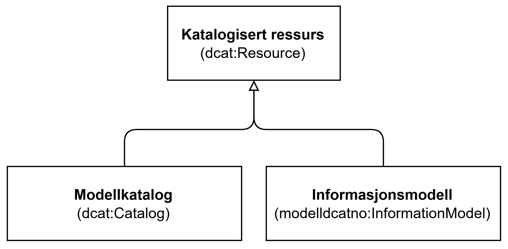

=== Klassen Katalogisert ressurs (`(dcat:Resource)`) [[KatalogisertRessurs]]

[[img-KlassenKatalogisertRessurs]]
.Klassen Katalogisert ressurs (`dcat:Resource`)
[link=images/KlassenKatalogisertRessurs.png]

[cols="30s,70d"]
|===
| __English name__ | __Cataloged resource__
| URI | `dcat:Resource`
| Anvendelse / __Usage note__ | Klassen brukes til å representere en ressurs som er beskrevet i en katalogen.

__This class is used to represent a cataloged resource.__
| Merknad / __Note__ | Dette er en abstrakt klasse og skal i en konkret anvendelse erstattes med en av spesialiseringene, dvs.  <<Informasjonsmodell, Informasjonsmodell>> eller <<Modellkatalog, Modellkatalog>>.

__This is an abstract class and should in a concrete application be replaced by one of the specializations, i.e., <<Informasjonsmodell, Information model>> or <<Modellkatalog, Model catalog>>.__
|===

