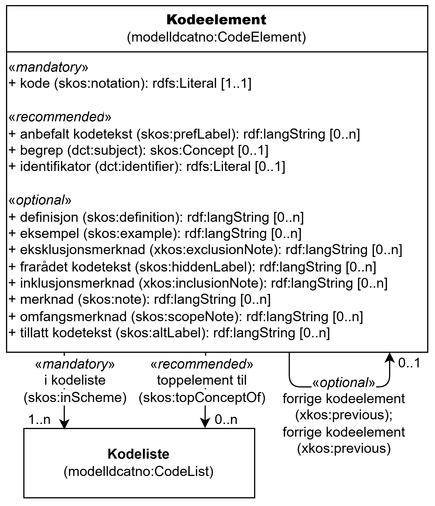

=== Klassen Kodeelement (`modelldcatno:CodeElement`) [[Kodeelement]]

[[img-KlassenKodeelement]]
.Klassen Kodeelement (`modelldcatno:CodeElement`) og klassene den refererer til
[link=images/KlassenKodeelement.png]

[cols="30s,70d"]
|===
| __English name__ | __Code Element__
| URI | `modelldcatno:CodeElement`
| Anvendelse / __Usage note__ | Klassen brukes til å representere et kodeelement.

__This class is used to represent a code element.__
|===

==== Obligatoriske egenskaper for klassen __Kodeelement__ [[Kodeelement-obligatoriske-egenskaper]]

===== Kodeelement – i kodeliste (`skos:inScheme`) [[Kodeelement-i-kodeliste]]

[cols="30s,70d"]
|===
| __English name__ | __in scheme__
| URI | `skos:inScheme`
| Verdiområde / __Range__ | `modelldcatno:CodeList`
| Anvendelse / __Usage note__ | Egenskapen brukes til å referere til kodeliste som kodeelementet inngår i.

__This property is used to refer to the code list that the code element is included in.__
| Multiplisitet / __Multiplicity__ | `1..n`
| Kravnivå / __Requirement level__ | Obligatorisk / __Mandatory__
|===

===== Kodeelement – kode (`skos:notation`) [[Kodeelement-kode]]

[cols="30s,70d"]
|===
| __English name__ | __notation__
| URI | `skos:notation`
| Verdiområde / __Range__ | `rdfs:Literal`
| Anvendelse / __Usage note__ | Egenskapen brukes til å angi representasjonen av kodeelementet, vanligvis kalt «koden».

__This property is used to specify the notation for the code element (usually called the "code").__
| Multiplisitet / __Multiplicity__ | `1..1`
| Kravnivå / __Requirement level__ | Obligatorisk / __Mandatory__
|===

==== Anbefalte egenskaper for klassen __Kodeelement__ [[Kodeelement-anbefalte-egenskaper]]

===== Kodeelement – anbefalt kodetekst (`skos:prefLabel`) [[Kodeelement-anbefalt-kodetekst]]

[cols="30s,70d"]
|===
| __English name__ | __pref label__
| URI | `skos:prefLabel`
| Verdiområde / __Range__ | `rdf:langString`
| Anvendelse / __Usage note__ | Egenskapen brukes til å angi referere til den anbefalte kodeteksten for kodeelementet, dvs. teksten som anses best egnet for kodeelementet. Egenskapen bør gjentas når teksten finnes i flere ulike språk.

__This property is used to specify the preferred label for the code element. It should be repeated when the label exists in multiple languages.__
| Multiplisitet / __Multiplicity__ | `0..n`
| Kravnivå / __Requirement level__ | Anbefalt / __Recommended__
| Merknad / __Note__ | Det bør være maksimalt én anbefalt kodetekst per språk.

__There should be at most one preferred label per language.__
|===

===== Kodeelement – begrep (`dct:subject`) [[Kodeelement-begrep]]

[cols="30s,70d"]
|===
| __English name__ | __subject__
| URI | `dct:subject`
| Verdiområde / __Range__ | `skos:Concept`
| Anvendelse / __Usage note__ | Egenskapen brukes til å angi referere til begrep som er viktig for å forstå og tolke kodeelementet.

__This property is used to refer to the concept that is important for understanding and interpreting the code element.__
| Multiplisitet / __Multiplicity__ | `0..1`
| Kravnivå / __Requirement level__ | Anbefalt / __Recommended__
|===

===== Kodeelement – identifikator (`dct:identifier`) [[Kodeelement-identifikator]]

[cols="30s,70d"]
|===
| __English name__ | __identifier__
| URI | `dct:identifier`
| Verdiområde / __Range__ | `rdfs:Literal`
| Anvendelse / __Usage note__ | Egenskapen brukes til å angi en unik og persistent identifisering av et kodeelement.

__This property is used to specify a unique and persistent identification of a code element.__
| Multiplisitet / __Multiplicity__ | `0..1`
| Kravnivå / __Requirement level__ | Anbefalt / __Recommended__
|===

===== Kodeelement – toppelement til (`skos:topConceptOf`) [[Kodeelement-toppelement-til]]

[cols="30s,70d"]
|===
| __English name__ | __top concept of__
| URI | `skos:topConceptOf`
| Verdiområde / __Range__ | `modelldcatno:CodeList`
| Anvendelse / __Usage note__ | Egenskapen brukes til å referere til kodeliste som kodeelementet er det første kodeelementet i.

__This property is used to refer to the code list in which the code element is the first code element.__
| Multiplisitet / __Multiplicity__ | `0..n`
| Kravnivå / __Requirement level__ | Anbefalt / __Recommended__
|===

==== Valgfrie egenskaper for klassen __Kodeelement__ [[Kodeelement-valgfrie-egenskaper]]

===== Kodeelement – definisjon (`skos:definition`) [[Kodeelement-definisjon]]

[cols="30s,70d"]
|===
| __English name__ | __definition__
| URI | `skos:definition`
| Verdiområde / __Range__ | `rdf:langString`
| Anvendelse / __Usage note__ | Egenskapen brukes til å angi definisjonen av begrepet som kodeelementet representerer. Egenskapen bør gjentas når definisjonen finnes i flere ulike språk.

__This property is used to specify the definition of the concept represented by the code element. It should be repeated when the definition exists in multiple languages.__
| Multiplisitet / __Multiplicity__ | `0..n`
| Kravnivå / __Requirement level__ | Valgfri / __Optional__
|===

===== Kodeelement – eksempel (`skos:example`) [[Kodeelement-eksempel]]

[cols="30s,70d"]
|===
| __English name__ | __example__
| URI | `skos:example`
| Verdiområde / __Range__ | `rdf:langString`
| Anvendelse / __Usage note__ | Egenskapen brukes til å angi eksempel på begrepet som kodeelementet representerer. Egenskapen bør gjentas når eksemplet finnes i flere ulike språk.

__This property is used to specify example of the concept represented by the code element. It should be repeated when the example exists in multiple languages.__
| Multiplisitet / __Multiplicity__ | `0..n`
| Kravnivå / __Requirement level__ | Valgfri / __Optional__
|===

===== Kodeelement – eksklusjonsmerknad (`xkos:exclusionNote`) [[Kodeelement-eksklusjonsmerknad]]

[cols="30s,70d"]
|===
| __English name__ | __exclusion note__
| URI | `xkos:exclusionNote`
| Verdiområde / __Range__ | `rdf:langString`
| Anvendelse / __Usage note__ | Egenskapen brukes til å angi merknad om hva som er ekskludert i kodeelementet. Egenskapen bør gjentas når merknaden finnes i flere ulike språk.

__This property is used to specify exclusion note for the code element. It should be repeated when the note exists in multiple languages.__
| Multiplisitet / __Multiplicity__ | `0..n`
| Kravnivå / __Requirement level__ | Valgfri / __Optional__
|===

===== Kodeelement – forrige kodeelement (`xkos:previous`) [[Kodeelement-forrige-kodeelement]]

[cols="30s,70d"]
|===
| __English name__ | __previous__
| URI | `xkos:previous`
| Verdiområde / __Range__ | `modelldcatno:CodeElement`
| Anvendelse / __Usage note__ | Egenskapen brukes til å angi referere til kodeelementet som kommer foran det aktuelle kodeelementet.

__This property is used to specify the code element that comes before the current code element.__
| Multiplisitet / __Multiplicity__ | `0..1`
| Kravnivå / __Requirement level__ | Valgfri / __Optional__
|===

===== Kodeelement – frarådet kodetekst (`skos:hiddenLabel`) [[Kodeelement-frarådet-kodetekst]]

[cols="30s,70d"]
|===
| __English name__ | __hidden label__
| URI | `skos:hiddenLabel`
| Verdiområde / __Range__ | `rdf:langString`
| Anvendelse / __Usage note__ | Egenskapen brukes til å angi kodetekst som anses som uegnet for kodeelementet. Egenskapen bør gjentas når kodeteksten finnes i flere ulike språk.

__This property is used to specify label that is considered inappropriate for the code element. It should be repeated when the label exists in multiple languages.__
| Multiplisitet / __Multiplicity__ | `0..n`
| Kravnivå / __Requirement level__ | Valgfri / __Optional__
|===

===== Kodeelement – inklusjonsmerknad (`xkos:inclusionNote`) [[Kodeelement-inklusjonsmerknad]]

[cols="30s,70d"]
|===
| __English name__ | __inclusion note__
| URI | `xkos:inclusionNote`
| Verdiområde / __Range__ | `rdf:langString`
| Anvendelse / __Usage note__ | Egenskapen brukes til å angi merknad om hva som er inkludert i kodeelementet. Egenskapen bør gjentas når merknaden finnes i flere ulike språk.

__This property is used to specify inclusion note for the code element. It should be repeated when the note exists in multiple languages.__
| Multiplisitet / __Multiplicity__ | `0..n`
| Kravnivå / __Requirement level__ | Valgfri / __Optional__
|===

===== Kodeelement – merknad (`skos:note`) [[Kodeelement-merknad]]

[cols="30s,70d"]
|===
| __English name__ | __note__
| URI | `skos:note`
| Verdiområde / __Range__ | `rdf:langString`
| Anvendelse / __Usage note__ | Egenskapen brukes til å angi merknad om kodeelementet. Egenskapen bør gjentas når merknaden finnes i flere ulike språk.

__This property is used to specify note about the code element. It should be repeated when the note exists in multiple languages.__
| Multiplisitet / __Multiplicity__ | `0..n`
| Kravnivå / __Requirement level__ | Valgfri / __Optional__
|===

===== Kodeelement – neste kodeelement (`xkos:next`) [[Kodeelement-neste-kodeelement]]

[cols="30s,70d"]
|===
| __English name__ | __next__
| URI | `xkos:next`
| Verdiområde / __Range__ | `modelldcatno:CodeElement`
| Anvendelse / __Usage note__ | Egenskapen brukes til å referere til kodeelementet som kommer etter det aktuelle kodeelementet.

__This property is used to refer to the code element that comes after the current code element.__
| Multiplisitet / __Multiplicity__ | `0..1`
| Kravnivå / __Requirement level__ | Valgfri / __Optional__
|===

===== Kodeelement – omfangsmerknad (`skos:scopeNote`) [[Kodeelement-omfangsmerknad]]

[cols="30s,70d"]
|===
| __English name__ | __scope note__
| URI | `skos:scopeNote`
| Verdiområde / __Range__ | `rdf:langString`
| Anvendelse / __Usage note__ | Egenskapen brukes til å angi merknad ang. bruken av kodeelementet. Egenskapen bør gjentas når merknaden finnes i flere ulike språk.

__This property is used to specify note regarding the use of the code element. It should be repeated when the note exists in multiple languages.__
| Multiplisitet / __Multiplicity__ | `0..n`
| Kravnivå / __Requirement level__ | Valgfri / __Optional__
|===

===== Kodeelement – tillatt kodetekst (`skos:altLabel`) [[Kodeelement-tillatt-kodetekst]]

[cols="30s,70d"]
|===
| __English name__ | __alt label__
| URI | `skos:altLabel`
| Verdiområde / __Range__ | `rdf:langString`
| Anvendelse / __Usage note__ | Egenskapen brukes til å angi alternativ kodetekst (som kan brukes ved siden av den anbefalte kodeteksten). Egenskapen bør gjentas når kodeteksten finnes i flere ulike språk.

__This property is used to specify alternative label for the code element. It should be repeated when the label exists in multiple languages.__
| Multiplisitet / __Multiplicity__ | `0..n`
| Kravnivå / __Requirement level__ | Valgfri / __Optional__
|===

