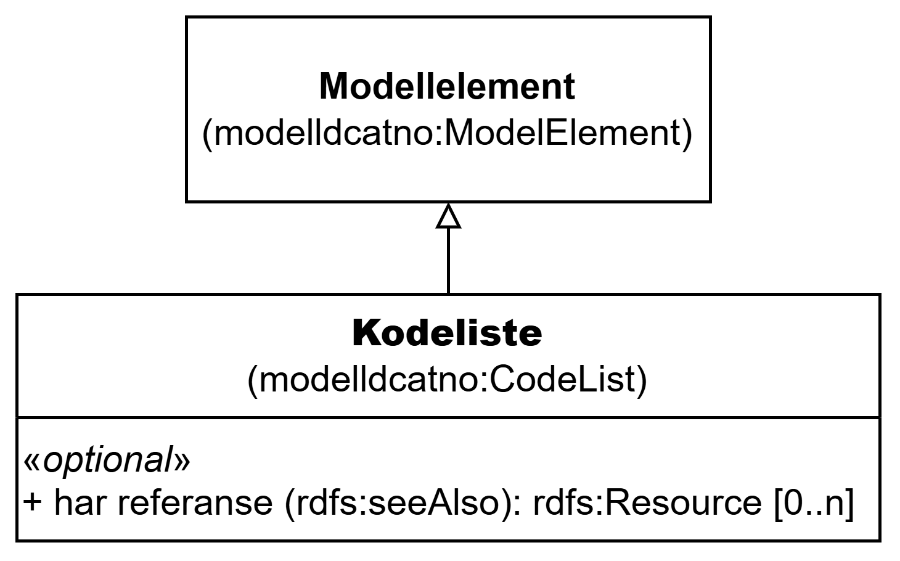

=== Klassen Kodeliste (`modelldcatno:CodeList`) [[Kodeliste]]

[[img-KlassenKodeliste]]
.Klassen Kodeliste (`modelldcatno:CodeList`) og klassene den refererer til
[link=images/KlassenKodeliste.png]

NOTE: Se <<Modellelement>> for egenskaper som SKAL/BØR/KAN brukes, i tillegg til egenskapen(e) spesifisert her for denne klassen.

[cols="30s,70d"]
|===
| __English name__ | __Code List__
| URI | `modelldcatno:CodeList`
| Subklasse av / __Subclass of__ | Modellelement (`modelldcatno:ModelElement`)
| Anvendelse / __Usage note__ | Klassen brukes til å representere en kodeliste.

__This class is used to represent a code list.__
|===

==== Valgfrie egenskaper for klassen __Kodeliste__ [[Kodeliste-valgfrie-egenskaper]]

===== Kodeliste – har referanse (`rdfs:seeAlso`) [[Kodeliste-har-referanse]]

[cols="30s,70d"]
|===
| __English name__ | __see also__
| URI | `rdfs:seeAlso`
| Verdiområde / __Range__ | `rdfs:Resource`
| Anvendelse / __Usage note__ | Egenskapen brukes til å referere til en ekstern beskrivelse av kodelisten.

__This property is used to refer to an external description of the code list.__
| Multiplisitet / __Multiplicity__ | `0..n`
| Kravnivå / __Requirement level__ | Valgfri / __Optional__
|===

