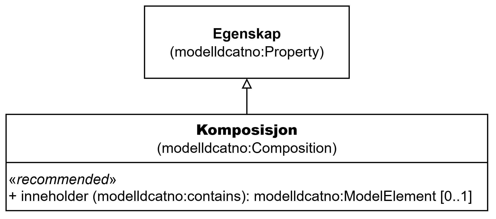

=== Klassen Komposisjon (`modelldcatno:Composition`) [[Komposisjon]]

[[img-KlassenKomposisjon]]
.Klassen Komposisjon (`modelldcatno:Composition`) og klassene den refererer til
[link=images/KlassenKomposisjon.png]

[cols="30s,70d"]
|===
| __English name__ | __Composition__
| URI | `modelldcatno:Composition`
| Subklasse av / __Subclass of__ | Egenskap (`modelldcatno:Property`)
| Anvendelse / __Usage note__ | Klassen brukes til å beskrive komposisjon.

__This class is used to describe composition.__
|===

==== Anbefalte egenskaper for klassen __Komposisjon__ [[Komposisjon-anbefalte-egenskaper]]

===== Komposisjon – inneholder (`modelldcatno:contains`) [[Komposisjon-inneholder]]

[cols="30s,70d"]
|===
| __English name__ | __contains__
| URI | `modelldcatno:contains`
| Subegenskap av / __Subproperty of__ | `modelldcatno:hasType`
| Verdiområde / __Range__ | `modelldcatno:ModelElement`
| Anvendelse / __Usage note__ | Egenskapen brukes til å referere til modellelementet som inngår som et medlem i en komposisjon.

__This property is used to refer to the model element that is a member of a composition.__
| Multiplisitet / __Multiplicity__ | `0..1`
| Kravnivå / __Requirement level__ | Anbefalt / __Recommended__
|===

