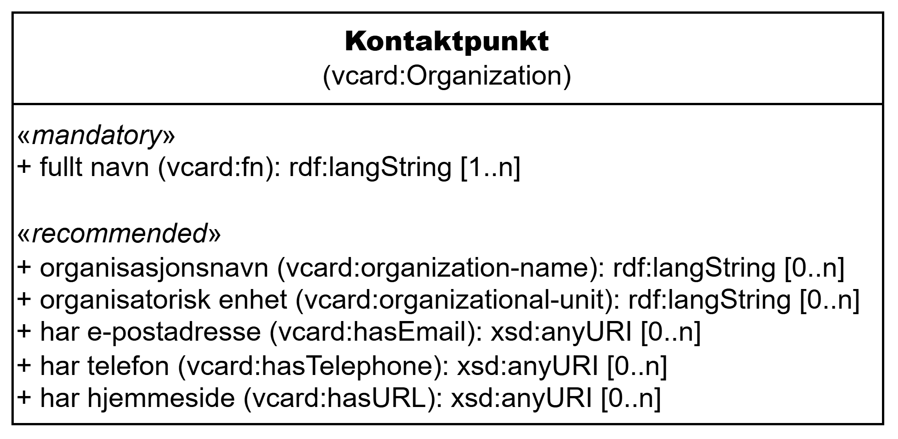

=== Klassen Kontaktpunkt (`vcard:Organization`) [[Kontaktpunkt]]

[[img-KlassenKontaktpunkt]]
.Klassen Kontaktpunkt (`vcard:Organization`)
[link=images/KlassenKontaktpunkt.png]

[cols="30s,70d"]
|===
| __English name__ | __Contact point__
| URI | `vcard:Organization`
| Anvendelse / __Usage note__ | Klassen brukes til å representere et kontaktpunkt for en organisasjon.

__This class is used to represent a contact point for an organization.__
|===

==== Obligatoriske egenskaper for klassen __Kontaktpunkt__ [[Kontaktpunkt-obligatoriske-egenskaper]]

===== Kontaktpunkt – fullt navn (`vcard:fn`) [[Kontaktpunkt-fullt-navn]]

[cols="30s,70d"]
|===
| __English name__ | __fn__
| URI | `vcard:fn`
| Verdiområde / __Range__ | `rdf:langString`
| Anvendelse / __Usage note__ | Egenskapen brukes til å angi et fullt navn for organisasjonen. Egenskapen bør gjentas når navnet er på flere språk.

__This property is used to specify a full name of the organization. It should be repeated when the name is in multiple languages.__
| Multiplisitet / __Multiplicity__ | `1..n`
| Kravnivå / __Requirement level__ | Obligatorisk / __Mandatory__
|===

Eksempel i RDF Turtle: 
-----
<digdir> a vcard:Organization ;
    vcard:fn "Digitaliseringsdirektoratet"@nb , "The Norwegian Digitalisation Agency"@en ;
    .
-----

==== Anbefalte egenskaper for klassen __Kontaktpunkt__ [[Kontaktpunkt-anbefalte-egenskaper]]

===== Kontaktpunkt – har e-postadresse (`vcard:hasEmail`) [[Kontaktpunkt-har-e-postadresse]]

[cols="30s,70d"]
|===
| __English name__ | __has email__
| URI | `vcard:hasEmail`
| Verdiområde / __Range__ | `xsd:anyURI`
| Anvendelse / __Usage note__ | Egenskapen brukes til å angi e-postadresse til kontaktpunktet.

__This property is used to specify email address for the contact point.__
| Multiplisitet / __Multiplicity__ | `0..n`
| Kravnivå / __Requirement level__ | Anbefalt / __Recommended__
|===

Eksempel i RDF Turtle: 
-----
<digdir> a vcard:Organization ;
    vcard:hasEmail <mailto:postmottak@digdir.no> ;
    .
-----

===== Kontaktpunkt – har hjemmeside (`vcard:hasURL`) [[Kontaktpunkt-har-hjemmeside]]

[cols="30s,70d"]
|===
| __English name__ | __has url__
| URI | `vcard:hasURL`
| Verdiområde / __Range__ | `xsd:anyURI`
| Anvendelse / __Usage note__ | Egenskapen brukes til å angi hjemmeside for kontaktpunktet.

__This property is used to specify website address for the contact point.__
| Multiplisitet / __Multiplicity__ | `0..n`
| Kravnivå / __Requirement level__ | Anbefalt / __Recommended__
|===

Eksempel i RDF Turtle: 
-----
<digdir> a vcard:Organization ;
    vcard:hasURL <https://digdir.no> ;
    .
-----

===== Kontaktpunkt – har telefon (`vcard:hasTelephone`) [[Kontaktpunkt-har-telefon]]

[cols="30s,70d"]
|===
| __English name__ | __has telephone__
| URI | `vcard:hasTelephone`
| Verdiområde / __Range__ | `xsd:anyURI`
| Anvendelse / __Usage note__ | Egenskapen brukes til å angi telefonnummer for kontaktpunktet.

__This property is used to specify telephone number for the contact point.__
| Multiplisitet / __Multiplicity__ | `0..n`
| Kravnivå / __Requirement level__ | Anbefalt / __Recommended__
|===

Eksempel i RDF Turtle: 
-----
<digdir> a vcard:Organization ;
    vcard:hasTelephone <tel:+47-22451000> ;
    .
-----

===== Kontaktpunkt – organisasjonsnavn (`vcard:organization-name`) [[Kontaktpunkt-organisasjonsnavn]]

[cols="30s,70d"]
|===
| __English name__ | __organization name__
| URI | `vcard:organization-name`
| Verdiområde / __Range__ | `rdf:langString`
| Anvendelse / __Usage note__ | Egenskapen brukes til å angi organisasjonsnavn. Egenskapen bør gjentas når navnet er på flere språk.

__This property is used to specify organization name. It should be repeated when the name is in multiple languages.__
| Multiplisitet / __Multiplicity__ | `0..n`
| Kravnivå / __Requirement level__ | Anbefalt / __Recommended__
|===

Eksempel i RDF Turtle: 
-----
<digdir> a vcard:Organization ;
    vcard:organization-name "Digitaliseringsdirektoratet"@nb , "The Norwegian Digitalisation Agency"@en ;
    .
-----

===== Kontaktpunkt – organisatorisk enhet (`vcard:organizational-unit`) [[Kontaktpunkt-organisatorisk-enhet]]

[cols="30s,70d"]
|===
| __English name__ | __organizational unit__
| URI | `vcard:organizational-unit`
| Verdiområde / __Range__ | `rdf:langString`
| Anvendelse / __Usage note__ | Egenskapen brukes til å angi navnet til en organisatorisk enhet. Egenskapen bør gjentas når navnet er på flere språk.

__This property is used to specify the name of an organizational unit. It should be repeated when the name is in multiple languages.__
| Multiplisitet / __Multiplicity__ | `0..n`
| Kravnivå / __Requirement level__ | Anbefalt / __Recommended__
|===

Eksempel i RDF Turtle: 
-----
<digdir> a vcard:Organization ;
    vcard:organizational-unit "Informasjonsforvaltning"@nb , "Information Governance"@en ;
    .
-----
