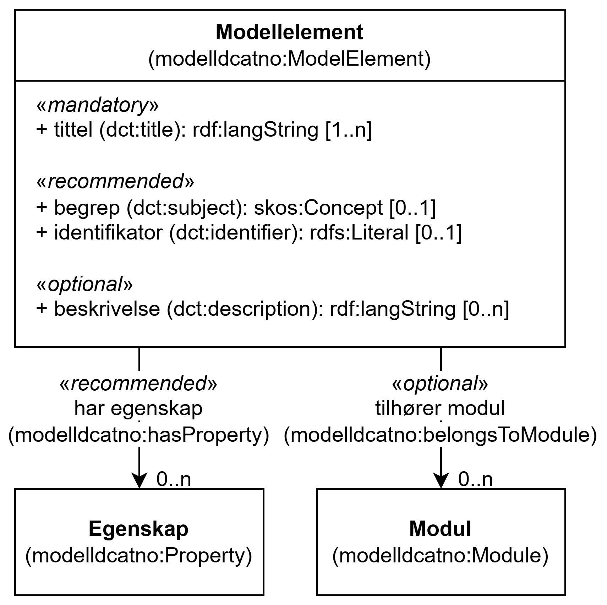

=== Klassen Modellelement (`modelldcatno:ModelElement`) [[Modellelement]]

[[img-KlassenModellElement]]
.Klassen Modellelement (`modelldcatno:ModelElement`) og klassene den refererer til
[link=images/KlassenModellElement.png]

[cols="30s,70d"]
|===
| __English name__ | __Model Element__
| URI | `modelldcatno:ModelElement`
| Anvendelse / __Usage note__ | Klassen brukes til å representere et modellelement.

__This class is used to represent a model element.__
|===

==== Obligatoriske egenskaper for klassen __Modellelement__ [[Modellelement-obligatoriske-egenskaper]]

===== Modellelement – tittel (`dct:title`) [[Modellelement-tittel]]

[cols="30s,70d"]
|===
| __English name__ | __title__
| URI | `dct:title`
| Verdiområde / __Range__ | `rdf:langString`
| Anvendelse / __Usage note__ | Egenskapen brukes til å angi navnet på modellelement. Egenskapen bør gjentas når navnet finnes i flere ulike språk.

__This property is used to specify the name of the model element. This property should be repeated when the name exists in multiple languages.__
| Multiplisitet / __Multiplicity__ | `1..n`
| Kravnivå / __Requirement level__ | Obligatorisk / __Mandatory__
|===

==== Anbefalte egenskaper for klassen __Modellelement__ [[Modellelement-anbefalte-egenskaper]]

===== Modellelement – begrep (`dct:subject`) [[Modellelement-begrep]]

[cols="30s,70d"]
|===
| __English name__ | __subject__
| URI | `dct:subject`
| Verdiområde / __Range__ | `skos:Concept`
| Anvendelse / __Usage note__ | Egenskapen brukes til å referere til begrepet som er viktig for å forstå og tolke modellelementet.

__This property is used to refer to the concept that is important for understanding and interpreting the model element.__
| Multiplisitet / __Multiplicity__ | `0..1`
| Kravnivå / __Requirement level__ | Anbefalt / __Recommended__
|===

===== Modellelement – har egenskap (`modelldcatno:hasProperty`) [[Modellelement-har-egenskap]]

[cols="30s,70d"]
|===
| __English name__ | __has property__
| URI | `modelldcatno:hasProperty`
| Verdiområde / __Range__ | `modelldcatno:Property`
| Anvendelse / __Usage note__ | Egenskapen brukes til å referere til en egenskap av modellelementet.

__This property is used to refer to a property of the model element.__
| Multiplisitet / __Multiplicity__ | `0..n`
| Kravnivå / __Requirement level__ | Anbefalt / __Recommended__
|===

===== Modellelement – identifikator (`dct:identifier`) [[Modellelement-identifikator]]

[cols="30s,70d"]
|===
| __English name__ | __identifier__
| URI | `dct:identifier`
| Verdiområde / __Range__ | `rdfs:Literal`
| Anvendelse / __Usage note__ | Egenskapen brukes til å angi en unik og persistent identifikator til modellelementet.

__This property is used to specify a unique and persistent identifier for the model element.__
| Multiplisitet / __Multiplicity__ | `0..1`
| Kravnivå / __Requirement level__ | Anbefalt / __Recommended__
|===

==== Valgfrie egenskaper for klassen __Modellelement__ [[Modellelement-valgfrie-egenskaper]]

===== Modellelement – beskrivelse (`dct:description`) [[Modellelement-beskrivelse]]

[cols="30s,70d"]
|===
| __English name__ | __description__
| URI | `dct:description`
| Verdiområde / __Range__ | `rdf:langString`
| Anvendelse / __Usage note__ | Egenskapen brukes til å angi fritekstbeskrivelse av modellelementet. Egenskapen bør gjentas når beskrivelsen finnes i flere ulike språk.

__This property is used to specify a textual description of the model element. This property should be repeated when the description is available in multiple languages.__
| Multiplisitet / __Multiplicity__ | `0..n`
| Kravnivå / __Requirement level__ | Valgfri / __Optional__
|===

===== Modellelement – tilhører modul (`modelldcatno:belongsToModule`) [[Modellelement-tilhører-modul]]

[cols="30s,70d"]
|===
| __English name__ | __belongs to module__
| URI | `modelldcatno:belongsToModule`
| Verdiområde / __Range__ | `modelldcatno:Module`
| Anvendelse / __Usage note__ | Egenskapen brukes til å referere til modellmodul/delmodell som modellelementet inngår i.

__This property is used to refer to the module/submodel that the model element belongs to.__
| Multiplisitet / __Multiplicity__ | `0..n`
| Kravnivå / __Requirement level__ | Valgfri / __Optional__
|===
