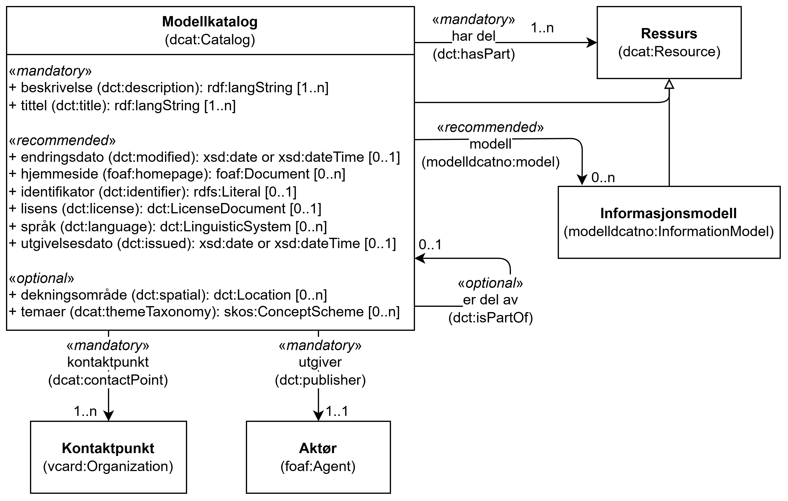

=== Klassen Modellkatalog (`dcat:Catalog`) [[Modellkatalog]]

[[img-KlassenModellkatalog]]
.Klassen Modellkatalog (`dcat:Catalog`) og klassene den refererer til
[link=images/KlassenModellkatalog.png]

[cols="30s,70d"]
|===
| __English name__ | __Catalog__
| URI | `dcat:Catalog`
| Subklasse av / __Subclass of__ | Ressurs (`dcat:Resource`)
| Anvendelse / __Usage note__ | Klassen brukes til å representere en modellkatalog.

__This class is used to represent a model catalog.__
|===

==== Obligatoriske egenskaper for klassen __Modellkatalog__ [[Modellkatalog-obligatoriske-egenskaper]]

===== Modellkatalog – beskrivelse (`dct:description`) [[Modellkatalog-beskrivelse]]

[cols="30s,70d"]
|===
| __English name__ | __description__
| URI | `dct:description`
| Verdiområde / __Range__ | `rdf:langString`
| Anvendelse / __Usage note__ | Egenskapen brukes til å angi fritekstbeskrivelse av katalogen. Egenskapen bør gjentas når beskrivelsen finnes i flere ulike språk.

__This property is used to specify textual description of the catalog. It should be repeated when the description exists in multiple languages.__
| Multiplisitet / __Multiplicity__ | `1..n`
| Kravnivå / __Requirement level__ | Obligatorisk / __Mandatory__
|===

===== Modellkatalog – har del (`dct:hasPart`) [[Modellkatalog-har-del]]

[cols="30s,70d"]
|===
| __English name__ | __has part__
| URI | `dct:hasPart`
| Verdiområde / __Range__ | `dcat:Resource`
| Anvendelse / __Usage note__ | Egenskapen brukes til å referere til en informasjonsmodell eller en annen modellkatalog.

__This property is used to refer to an information model or another model catalog.__
| Multiplisitet / __Multiplicity__ | `1..n`
| Kravnivå / __Requirement level__ | Obligatorisk / __Mandatory__
| Merknad / __Note__ | Klassen Ressurs `dcat:Resource` er en abstrakt klasse og skal i en konkret anvendelse erstattes med en instans av dcat:Catalog (en Modellkatalog) eller en instans av modelldcatno:InformatoinModel (en Informasjonsmodell).

__The class Resource `dcat:Resource` is an abstract class and shall in a concrete application be replaced by an instance of dcat:Catalog (a Model Catalog) or an instance of modelldcatno:InformationModel (an Information Model).__
|===

===== Modellkatalog – kontaktpunkt (`dcat:contactPoint`) [[Modellkatalog-kontaktpunkt]]

[cols="30s,70d"]
|===
| __English name__ | __contact point__
| URI | `dcat:contactPoint`
| Verdiområde / __Range__ | `vcard:Organization`
| Anvendelse / __Usage note__ | Egenskapen brukes til å referere til kontaktpunkt med kontaktopplysninger, som kan brukes til å sende spørsmål om modellkatalogen.

__This property is used to refer to a contact point with contact information, which can be used to send questions about the model catalog.__
| Multiplisitet / __Multiplicity__ | `1..n`
| Kravnivå / __Requirement level__ | Obligatorisk / __Mandatory__
|===

===== Modellkatalog – tittel (`dct:title`) [[Modellkatalog-tittel]]

[cols="30s,70d"]
|===
| __English name__ | __title__
| URI | `dct:title`
| Verdiområde / __Range__ | `rdf:langString`
| Anvendelse / __Usage note__ | Egenskapen brukes til å angi navnet på katalogen.Egenskapen bør gjentas når navnet finnes i flere ulike språk.

__This property is used to specify the title of the catalog. It should be repeated when the title exists in multiple languages.__
| Multiplisitet / __Multiplicity__ | `1..n`
| Kravnivå / __Requirement level__ | Obligatorisk / __Mandatory__
|===

===== Modellkatalog – utgiver (`dct:publisher`) [[Modellkatalog-utgiver]]

[cols="30s,70d"]
|===
| __English name__ | __publisher__
| URI | `dct:publisher`
| Verdiområde / __Range__ | `foaf:Agent`
| Anvendelse / __Usage note__ | Egenskapen brukes til å referere til en aktør (virksomheten) som er ansvarlig for å gjøre katalogen tilgjengelig. 

__This property is used to specify the publisher of the catalog.__
| Multiplisitet / __Multiplicity__ | `1..1`
| Kravnivå / __Requirement level__ | Obligatorisk / __Mandatory__
|===

==== Anbefalte egenskaper for klassen __Modellkatalog__ [[Modellkatalog-anbefalte-egenskaper]]

===== Modellkatalog – endringsdato (`dct:modified`) [[Modellkatalog-endringsdato]]

[cols="30s,70d"]
|===
| __English name__ | __modified__
| URI | `dct:modified`
| Verdiområde / __Range__ | `xsd:date` or `xsd:dateTime`
| Anvendelse / __Usage note__ | Egenskapen brukes til å angi datoen for siste oppdatering/endring av katalogen.

__This property is used to specify modified the date when the catalog was last updated.__
| Multiplisitet / __Multiplicity__ | `0..1`
| Kravnivå / __Requirement level__ | Anbefalt / __Recommended__
|===

===== Modellkatalog – hjemmeside (`foaf:homepage`) [[Modellkatalog-hjemmeside]]

[cols="30s,70d"]
|===
| __English name__ | __homepage__
| URI | `foaf:homepage`
| Verdiområde / __Range__ | `foaf:Document`
| Anvendelse / __Usage note__ | Egenskapen brukes til å angi nettside som fungerer som hovedside for modellkatalogen.

__This property is used to specify homepage for the catalog.__
| Multiplisitet / __Multiplicity__ | `0..n`
| Kravnivå / __Requirement level__ | Anbefalt / __Recommended__
|===

===== Modellkatalog – identifikator (`dct:identifier`) [[Modellkatalog-identifikator]]

[cols="30s,70d"]
|===
| __English name__ | __identifier__
| URI | `dct:identifier`
| Verdiområde / __Range__ | `rdfs:Literal`
| Anvendelse / __Usage note__ | Egenskapen brukes til å angi identifikatoren til katalogen.

__This property is used to specify the identifier of the catalog.__
| Multiplisitet / __Multiplicity__ | `0..1`
| Kravnivå / __Requirement level__ | Anbefalt / __Recommended__
|===

===== Modellkatalog – lisens (`dct:license`) [[Modellkatalog-lisens]]

[cols="30s,70d"]
|===
| __English name__ | __license__
| URI | `dct:license`
| Verdiområde / __Range__ | `dct:LicenseDocument`
| Anvendelse / __Usage note__ | Egenskapen brukes til å referere til lisensen for modellkatalogen som beskriver hvordan den kan viderebrukes.

__This property is used to specify license for the catalog.__
| Multiplisitet / __Multiplicity__ | `0..1`
| Kravnivå / __Requirement level__ | Anbefalt / __Recommended__
| Merknad / _Note_ | Verdien SKAL velges fra EUs kontrollerte vokabular https://op.europa.eu/en/web/eu-vocabularies/concept-scheme/-/resource?uri=http://publications.europa.eu/resource/authority/licence[__Licence__ &#x29C9;, window="_blank", role="ext-link"].

__The value MUST be chosen from EU's controlled vocabulary https://op.europa.eu/en/web/eu-vocabularies/concept-scheme/-/resource?uri=http://publications.europa.eu/resource/authority/licence[Licence &#x29C9;, window="_blank", role="ext-link"].__
|===

Eksempel i RDF Turtle:
-----
<aCatalog> a dcat:Catalog ; 
   dct:license <http://publications.europa.eu/resource/authority/licence/CC_BY_4_0> ; 
   .
-----

===== Modellkatalog – modell (`modelldcatno:model`) [[Modellkatalog-modell]]

[cols="30s,70d"]
|===
| __English name__ | __model__
| URI | `modelldcatno:model`
| Verdiområde / __Range__ | `modelldcatno:InformationModel`
| Anvendelse / __Usage note__ | Egenskapen brukes til å referere til informasjonsmodell som er en del av modellkatalogen.

__This property is used to refer to information model which is part of the catalog.__
| Multiplisitet / __Multiplicity__ | `0..n`
| Kravnivå / __Requirement level__ | Anbefalt / __Recommended__
| Merknad / __Note__ | En Modellkatalog skal ha minst én instans av dcat:Resource (jf. <<Modellkatalog-har-del>>). Informasjonsmodell (modelldcatno:InformationModel) og Modellkatalog (dcat:Catalog) er i denne spesifikasjonen subklasser av dcat:Resource. Med mindre man skal ha en Modellkatalog som bare består av andre Modellkataloger, skal en Modellkatalog inneholde minst én instans av modelldcatno:InformationModel, selv om denne egenskapen er anbefalt og har multiplisitet 0..n.

__A Model Catalog shall have at least one instance of dcat:Resource (cf. <<Modellkatalog-har-del>>). Information Model (modelldcatno:InformationModel) and Model Catalog (dcat:Catalog) are in this specification subclasses of dcat:Resource. Unless you want to have a Model Catalog that only consists of other Model Catalogs, a Model Catalog shall contain at least one instance of modelldcatno:InformationModel, even though this property is recommended and has multiplicity 0..n.__
|===

===== Modellkatalog – språk (`dct:language`) [[Modellkatalog-språk]]

[cols="30s,70d"]
|===
| __English name__ | __language__
| URI | `dct:language`
| Verdiområde / __Range__ | `dct:LinguisticSystem`
| Anvendelse / __Usage note__ | Egenskapen brukes til å angi språket som katalogen er på. 

__This property is used to specify the language that the catalog is in.__
| Multiplisitet / __Multiplicity__ | `0..n`
| Kravnivå / __Requirement level__ | Anbefalt / __Recommended__
| Merknad / _Note_ | Verdien SKAL velges fra EU's kontrollerte vokabular https://op.europa.eu/en/web/eu-vocabularies/concept-scheme/-/resource?uri=http://publications.europa.eu/resource/authority/language[__Language__ &#x29C9;, window="_blank", role="ext-link"].

__The value MUST be chosen from EU's controlled vocabulary https://op.europa.eu/en/web/eu-vocabularies/concept-scheme/-/resource?uri=http://publications.europa.eu/resource/authority/language[Language &#x29C9;, window="_blank", role="ext-link"].__
|===

Eksempel i RDF Turtle:
-----
<aModCatalog> a dcat:Catalog ; 
   dct:language <http://publications.europa.eu/resource/authority/language/NOB> ; 
   .
-----

===== Modellkatalog – utgivelsesdato (`dct:issued`) [[Modellkatalog-utgivelsesdato]]

[cols="30s,70d"]
|===
| __English name__ | __issued__
| URI | `dct:issued`
| Verdiområde / __Range__ | `xsd:date` or `xsd:dateTime`
| Anvendelse / __Usage note__ | Egenskapen brukes til å angi datoen for utgivelse (publisering) av katalogen.

__This property is used to specify the date when the catalog was issued/published.__
| Multiplisitet / __Multiplicity__ | `0..1`
| Kravnivå / __Requirement level__ | Anbefalt / __Recommended__
|===

==== Valgfrie egenskaper for klassen __Modellkatalog__ [[Modellkatalog-valgfrie-egenskaper]]

===== Modellkatalog – dekningsområde (`dct:spatial`) [[Modellkatalog-dekningsområde]]

[cols="30s,70d"]
|===
| __English name__ | __spatial__
| URI | `dct:spatial`
| Verdiområde / __Range__ | `dct:Location`
| Anvendelse / __Usage note__ | Egenskapen brukes til å angi geografisk eller administrativt område som er dekket av katalogen.

__This property is used to specify spatial or administrative coverage of the catalog.__
| Multiplisitet / __Multiplicity__ | `0..n`
| Kravnivå / __Requirement level__ | Valgfri / __Optional__
| Merknad / _Note_ | Verdien SKAL velges fra EUs kontrollerte vokabularer https://op.europa.eu/en/web/eu-vocabularies/concept-scheme/-/resource?uri=http://publications.europa.eu/resource/authority/continent[__Continent__ &#x29C9;, window="_blank", role="ext-link"], https://op.europa.eu/en/web/eu-vocabularies/concept-scheme/-/resource?uri=http://publications.europa.eu/resource/authority/country[__Countries and territories__ &#x29C9;, window="_blank", role="ext-link"] eller https://op.europa.eu/en/web/eu-vocabularies/concept-scheme/-/resource?uri=http://publications.europa.eu/resource/authority/place[__Place__ &#x29C9;, window="_blank", role="ext-link"], HVIS den finnes på listene; https://sws.geonames.org/[__GeoNames__ &#x29C9;, window="_blank", role="ext-link"] SKAL i andre tilfeller brukes. 

__The value MUST be chosen from EU's controlled vocabularies https://op.europa.eu/en/web/eu-vocabularies/concept-scheme/-/resource?uri=http://publications.europa.eu/resource/authority/continent[Continent &#x29C9;, window="_blank", role="ext-link"], https://op.europa.eu/en/web/eu-vocabularies/concept-scheme/-/resource?uri=http://publications.europa.eu/resource/authority/country[Countries and territories &#x29C9;, window="_blank", role="ext-link"] or https://op.europa.eu/en/web/eu-vocabularies/concept-scheme/-/resource?uri=http://publications.europa.eu/resource/authority/place[Place &#x29C9;, window="_blank", role="ext-link"], IF it is in one of the lists;  if a particular location is not in one of the mentioned Named Authority Lists, https://sws.geonames.org/[GeoNames &#x29C9;, window="_blank", role="ext-link"] MUST be used.__
|===

Eksempel i RDF Turtle:
----
<aCatalog> a dcat:Catalog ;
   dct:spatial <http://publications.europa.eu/resource/authority/country/NOR> ; # Norge
   .
----

===== Modellkatalog – er del av (`dct:isPartOf`) [[Modellkatalog-er-del-av]]

[cols="30s,70d"]
|===
| __English name__ | __is part of__
| URI | `dct:isPartOf`
| Verdiområde / __Range__ | `dcat:Catalog`
| Anvendelse / __Usage note__ | Egenskapen brukes til å referere en katalog som denne katalogen fysisk eller logisk er inkludert i.

__This property is used to refer to a catalog that this catalog is physically or logically included in.__
| Multiplisitet / __Multiplicity__ | `0..1`
| Kravnivå / __Requirement level__ | Valgfri / __Optional__
|===

===== Modellkatalog – temaer (`dcat:themeTaxonomy`) [[Modellkatalog-temaer]]

[cols="30s,70d"]
|===
| __English name__ | __theme taxonomy__
| URI | `dcat:themeTaxonomy`
| Verdiområde / __Range__ | `skos:ConceptScheme`
| Anvendelse / __Usage note__ | Egenskapen brukes til å angi kunnskapsorganiseringssystem (KOS) som er brukt for å klassifisere katalogens innhold.

__This property is used to specify the knowledge organization system (KOS) used to classify the content of the catalog.__
| Multiplisitet / __Multiplicity__ | `0..n`
| Kravnivå / __Requirement level__ | Valgfri / __Optional__
| Merknad / __Note__ | https://psi.norge.no/los/struktur.html[Los &#x29C9;, window="_blank", role="ext-link"] BØR velges. 

__https://psi.norge.no/los/struktur.html[Los &#x29C9;, window="_blank", role="ext-link"] SHOULD be chosen.__
|===

