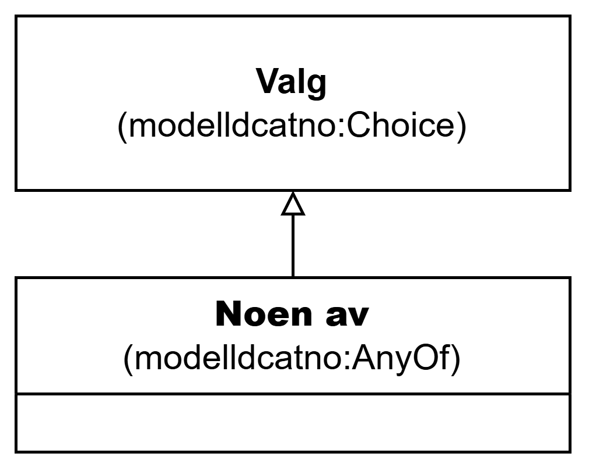

=== Klassen Noen av (`modelldcatno:AnyOf`) [[NoenAv]]

[[img-KlassenNoenAv]]
.Klassen Noen av (`modelldcatno:AnyOf`)
[link=images/KlassenNoenAv.png]

NOTE: Se <<Valg>> for egenskaper som SKAL/BØR/KAN brukes.

[cols="30s,70d"]
|===
| __English name__ | __Any of__
| URI | `modelldcatno:AnyOf`
| Subklasse av / __Subclass of__ | Valg (`modelldcatno:Choice`)
| Anvendelse / __Usage note__ | Klassen brukes til å representere valg som uttrykker at ett eller flere valgbare modellelementer og/eller egenskaper må velges samtidig.

__This class is used to represent a choice that expresses that one or more selectable model elements and/or properties must be selected simultaneously.__
|===
