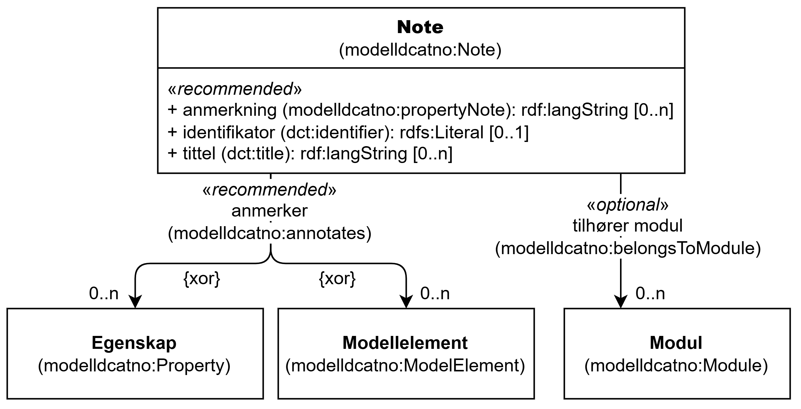

=== Klassen Note (`modelldcatno:Note`) [[Note]]

[[img-KlassenNote]]
.Klassen Note (`modelldcatno:Note`) og klassene den refererer til
[link=images/KlassenNote.png]

[cols="30s,70d"]
|===
| __English name__ | __Note__
| URI | `modelldcatno:Note`
| Anvendelse / __Usage note__ | Klassen brukes til å representere en note.

__This class is used to represent a note.__
|===

==== Anbefalte egenskaper for klassen __Note__ [[Note-anbefalte-egenskaper]]

===== Note – anmerker (`modelldcatno:annotates`) [[Note-anmerker]]

[cols="30s,70d"]
|===
| __English name__ | __annotates__
| URI | `modelldcatno:annotates`
| Verdiområde / __Range__ |  or `modelldcatno:ModelElement` or `modelldcatno:Property`
| Anvendelse / __Usage note__ | Egenskapen brukes til å referere til egenskap eller modellelement som noten omhandler.

__This property is used to specify annotates for the resource.__
| Multiplisitet / __Multiplicity__ | `0..n`
| Kravnivå / __Requirement level__ | Anbefalt / __Recommended__
| Merknad / __Note__ | En note, med unntak av subklassen Begrensningsregel (`modelldcatno:ConstraintRule`), må referere til en egenskap (`modelldcatno:Property`) eller et modellelement (`modelldcatno:ModelElement`).

__A note, with the exception of the subclass Constraint Rule (`modelldcatno:ConstraintRule`), must refer to a property (`modelldcatno:Property`) or a model element (`modelldcatno:ModelElement`).__
|===

===== Note – anmerkning (`modelldcatno:propertyNote`) [[Note-anmerkning]]

[cols="30s,70d"]
|===
| __English name__ | __property note__
| URI | `modelldcatno:propertyNote`
| Verdiområde / __Range__ | `rdf:langString`
| Anvendelse / __Usage note__ | Egenskapen brukes til å angi en kommentar i form av en fritekst. Egenskapen bør gjentas når beskrivelsen finnes i flere ulike språk.

__This property is used to specify a comment in the form of a free text. The property should be repeated when the comment exists in multiple languages.__
| Multiplisitet / __Multiplicity__ | `0..n`
| Kravnivå / __Requirement level__ | Anbefalt / __Recommended__
| Merknad / __Note__ | En Note, med unntak av subklassen Begrensningsregel (`modelldcatno:ConstraintRule`), må som minimum ha enten en tittel (`dct:title`) eller anmerkning (`modelldcatno:propertyNote`).

__A Note, with the exception of the subclass Constraint Rule (`modelldcatno:ConstraintRule`), must have at least either a title (`dct:title`) or a property note (`modelldcatno:propertyNote`).__
|===

===== Note – identifikator (`dct:identifier`) [[Note-identifikator]]

[cols="30s,70d"]
|===
| __English name__ | __identifier__
| URI | `dct:identifier`
| Verdiområde / __Range__ | `rdfs:Literal`
| Anvendelse / __Usage note__ | Egenskapen brukes til å angi en unik og persistent identifikator til noten.

__This property is used to specify a unique and persistent identifier for the note.__
| Multiplisitet / __Multiplicity__ | `0..1`
| Kravnivå / __Requirement level__ | Anbefalt / __Recommended__
|===

===== Note – tittel (`dct:title`) [[Note-tittel]]

[cols="30s,70d"]
|===
| __English name__ | __title__
| URI | `dct:title`
| Verdiområde / __Range__ | `rdf:langString`
| Anvendelse / __Usage note__ | Egenskapen brukes til å angi tittelen til noten. Egenskapen bør gjentas når tittelen finnes i flere ulike språk.

__This property is used to specify the title of the note. The property should be repeated when the title exists in multiple languages.__
| Multiplisitet / __Multiplicity__ | `0..n`
| Kravnivå / __Requirement level__ | Anbefalt / __Recommended__
| Merknad / __Note__ | En Note, med unntak av subklassen Begrensningsregel (`modelldcatno:ConstraintRule`), må som minimum ha enten en tittel (`dct:title`) eller anmerkning (`modelldcatno:propertyNote`).

__A Note, with the exception of the subclass Constraint Rule (`modelldcatno:ConstraintRule`), must have at least either a title (`dct:title`) or a property note (`modelldcatno:propertyNote`).__
|===

==== Valgfrie egenskaper for klassen __Note__ [[Note-valgfrie-egenskaper]]

===== Note – tilhører modul (`modelldcatno:belongsToModule`) [[Note-tilhører-modul]]

[cols="30s,70d"]
|===
| __English name__ | __belongs to module__
| URI | `modelldcatno:belongsToModule`
| Verdiområde / __Range__ | `modelldcatno:Module`
| Anvendelse / __Usage note__ | Egenskapen brukes til å referere til en modellmodul/delmodell som noten inngår i.

__This property is used to refer to a module/submodel in which the note is included.__
| Multiplisitet / __Multiplicity__ | `0..n`
| Kravnivå / __Requirement level__ | Valgfri / __Optional__
|===

