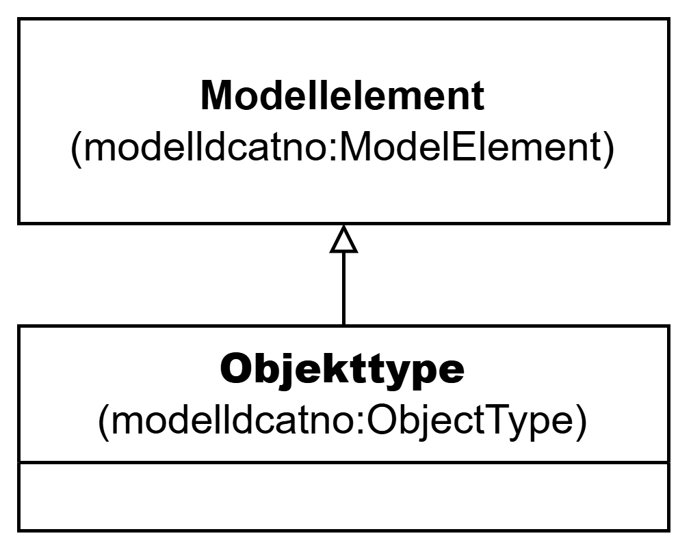

=== Klassen Objekttype (`modelldcatno:ObjectType`) [[Objekttype]]

[[img-KlassenObjekttype]]
.Klassen Objekttype (`modelldcatno:ObjectType`)
[link=images/KlassenObjekttype.png]

NOTE: Se <<Modellelement>> for egenskaper som SKAL/BØR/KAN brukes.

[cols="30s,70d"]
|===
| __English name__ | __Object Type__
| URI | `modelldcatno:ObjectType`
| Subklasse av / __Subclass of__ | Modellelement (`modelldcatno:ModelElement`)
| Anvendelse / __Usage note__ | Klassen brukes til å representere en objekttype (dvs. en klasse av objekter med felles egenskaper).

__This class is used to represent an object type.__
|===

