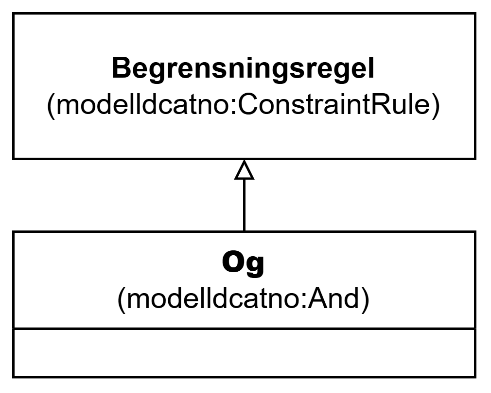

=== Klassen Og (`modelldcatno:And`) [[Og]]

[[img-KlassenOg]]
.Klassen Og (`modelldcatno:And`)
[link=images/KlassenOg.png]

[cols="30s,70d"]
|===
| __English name__ | __And__
| URI | `modelldcatno:And`
| Subklasse av / __Subclass of__ | Begrensningsregel (`modelldcatno:ConstraintRule`)
| Anvendelse / __Usage note__ | Klassen brukes til å representere begrensningsregel som uttrykker at alle egenskaper og/eller modellelementer den refererer til, må opptre samtidig.

__This class is used to represent a constraint rule that expresses that all properties and/or model elements it refers to must occur simultaneously.__
|===
