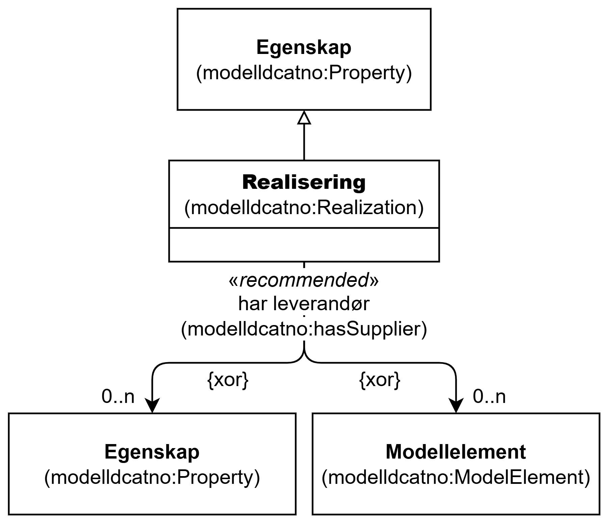

=== Klassen Realisering (`modelldcatno:Realization`) [[Realisering]]

[[img-KlassenRealisering]]
.Klassen Realisering (`modelldcatno:Realization`) og klassene den refererer til
[link=images/KlassenRealisering.png]

NOTE: Se <<Egenskap>> for egenskaper som SKAL/BØR/KAN brukes, i tillegg til egenskapen(e) spesifisert her for denne klassen.

[cols="30s,70d"]
|===
| __English name__ | __Realization__
| URI | `modelldcatno:Realization`
| Subklasse av / __Subclass of__ | Egenskap (`modelldcatno:Property`)
| Anvendelse / __Usage note__ | Klassen brukes til å beskrive realisering.

__This class is used to describe realization.__
|===

==== Anbefalte egenskaper for klassen __Realisering__ [[Realisering-anbefalte-egenskaper]]

===== Realisering – har leverandør (`modelldcatno:hasSupplier`) [[Realisering-har-leverandør]]

[cols="30s,70d"]
|===
| __English name__ | __has supplier__
| URI | `modelldcatno:hasSupplier`
| Verdiområde / __Range__ | `modelldcatno:ModelElement` or `modelldcatno:Property`
| Anvendelse / __Usage note__ | Egenskapen brukes til å referere til modellelementet/egenskapen som det aktuelle modellelementet/egenskapen er en realisering av.

__This property is used to refer to the model element/property that the current model element/property is a realization of.__
| Multiplisitet / __Multiplicity__ | `0..n`
| Kravnivå / __Requirement level__ | Anbefalt / __Recommended__
|===

