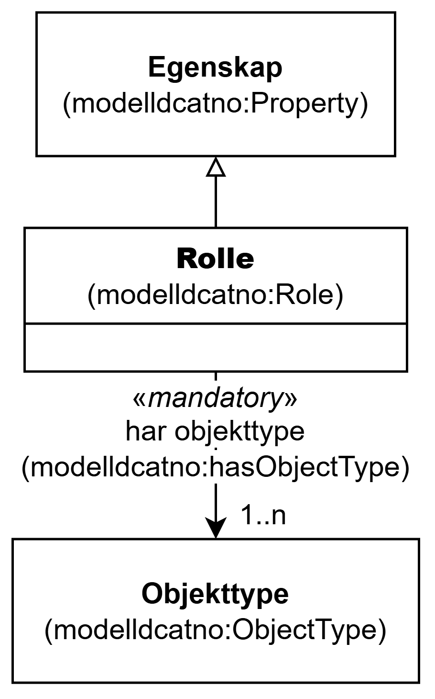

=== Klassen Rolle (`modelldcatno:Role`) [[Rolle]]

[[img-KlassenRolle]]
.Klassen Rolle (`modelldcatno:Role`) og klassene den refererer til
[link=images/KlassenRolle.png]

NOTE: Se <<Egenskap>> for egenskaper som SKAL/BØR/KAN brukes, i tillegg til egenskapen(e) spesifisert her for denne klassen.

[cols="30s,70d"]
|===
| __English name__ | __Role__
| URI | `modelldcatno:Role`
| Subklasse av / __Subclass of__ | Egenskap (`modelldcatno:Property`)
| Anvendelse / __Usage note__ | Klassen brukes til å representere en rolle.

__This class is used to represent a role.__
|===

==== Obligatoriske egenskaper for klassen __Rolle__ [[Rolle-obligatoriske-egenskaper]]

===== Rolle – har objekttype (`modelldcatno:hasObjectType`) [[Rolle-har-objekttype]]

[cols="30s,70d"]
|===
| __English name__ | __has object type__
| URI | `modelldcatno:hasObjectType`
| Verdiområde / __Range__ | `modelldcatno:ObjectType`
| Anvendelse / __Usage note__ | Egenskapen brukes til å referere til objekttypen som er knyttet til en rolle.

__This property is used to refer to the object type associated with a role.__
| Multiplisitet / __Multiplicity__ | `1..n`
| Kravnivå / __Requirement level__ | Obligatorisk / __Mandatory__
|===

