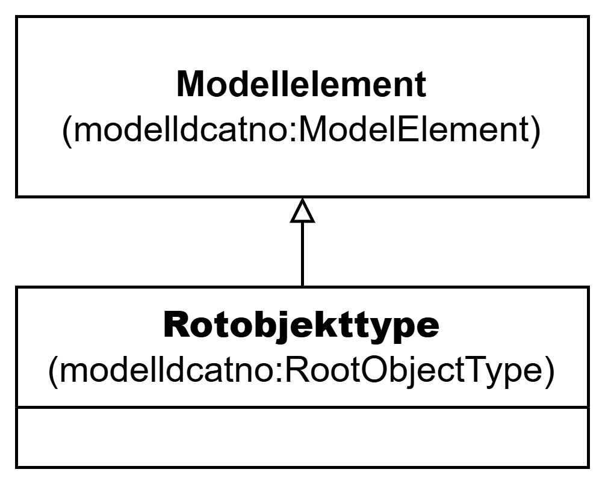

=== Klassen Rotobjekttype (`modelldcatno:RootObjectType`) [[Rotobjekttype]]

[[img-KlassenRotobjekttype]]
.Klassen Rotobjekttype (`modelldcatno:RootObjectType`)
[link=images/KlassenRotobjekttype.png]

NOTE: Se <<Modellelement>> for egenskaper som SKAL/BØR/KAN brukes.

[cols="30s,70d"]
|===
| __English name__ | __Root Object Type__
| URI | `modelldcatno:RootObjectType`
| Subklasse av / __Subclass of__ | Modellelement (`modelldcatno:ModelElement`)
| Anvendelse / __Usage note__ | Klassen brukes til å representere den overordnede objekttypen som omslutter alle de andre modellelementene i en modell.

__This class is used to represent the root object type in a model.__
|===

