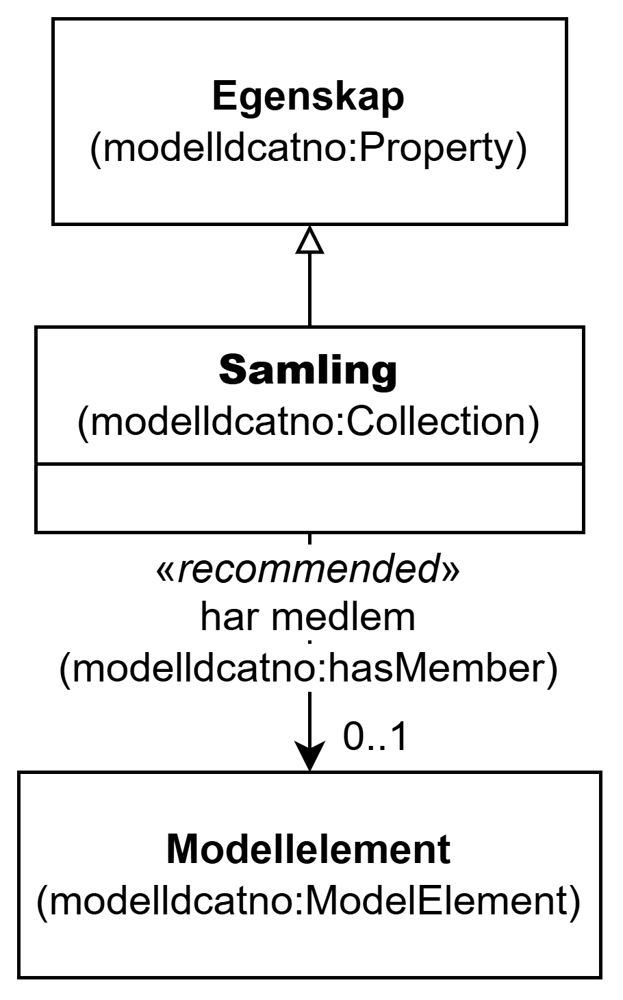

=== Klassen Samling (`modelldcatno:Collection`) [[Samling]]

[[img-KlassenSamling]]
.Klassen Samling (`modelldcatno:Collection`) og klassene den refererer til
[link=images/KlassenSamling.png]

[cols="30s,70d"]
|===
| __English name__ | __Collection__
| URI | `modelldcatno:Collection`
| Subklasse av / __Subclass of__ | Egenskap (`modelldcatno:Property`)
| Anvendelse / __Usage note__ | Klassen brukes til å representere en samling.

__This class is used to represent a collection.__
|===

==== Anbefalte egenskaper for klassen __Samling__ [[Samling-anbefalte-egenskaper]]

===== Samling – har medlem (`modelldcatno:hasMember`) [[Samling-har-medlem]]

[cols="30s,70d"]
|===
| __English name__ | __has member__
| URI | `modelldcatno:hasMember`
| Subegenskap av / __Subproperty of__ | `modelldcatno:hasType`
| Verdiområde / __Range__ | `modelldcatno:ModelElement`
| Anvendelse / __Usage note__ | Egenskapen brukes til å referere til modellelementet som inngår som et medlem i en samling.

__This property is used to refer to the model element that is a member of a collection.__
| Multiplisitet / __Multiplicity__ | `0..1`
| Kravnivå / __Requirement level__ | Anbefalt / __Recommended__
|===
