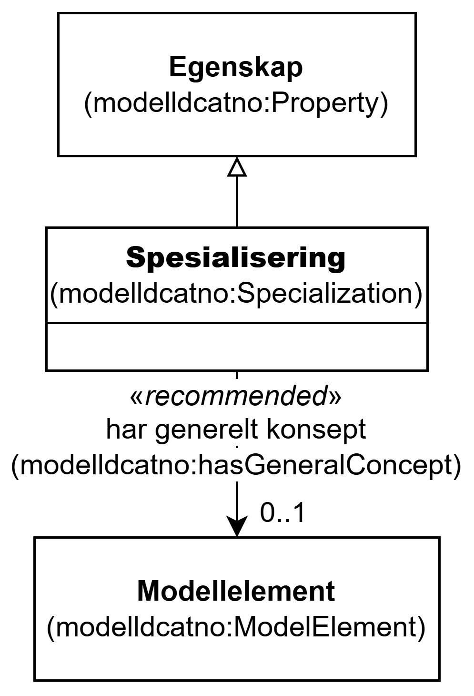

=== Klassen Spesialisering (`modelldcatno:Specialization`) [[Spesialisering]]

[[img-KlassenSpesialisering]]
.Klassen Spesialisering (`modelldcatno:Specialization`) og klassene den refererer til
[link=images/KlassenSpesialisering.png]

[cols="30s,70d"]
|===
| __English name__ | __Specialization__
| URI | `modelldcatno:Specialization`
| Subklasse av / __Subclass of__ | Egenskap (`modelldcatno:Property`)
| Anvendelse / __Usage note__ | Klassen brukes til å representere en spesialisering.

__This class is used to represent a specialization.__
|===

==== Anbefalte egenskaper for klassen __Spesialisering__ [[Spesialisering-anbefalte-egenskaper]]

===== Spesialisering – har generelt konsept (`modelldcatno:hasGeneralConcept`) [[Spesialisering-har-generelt-konsept]]

[cols="30s,70d"]
|===
| __English name__ | __has general concept__
| URI | `modelldcatno:hasGeneralConcept`
| Verdiområde / __Range__ | `modelldcatno:ModelElement`
| Anvendelse / __Usage note__ | Egenskapen brukes til å referere til det generelle konseptet (supertypen) i et arveforhold.

__This property is used to refer to the general concept (supertype) in an inheritance relationship.__
| Multiplisitet / __Multiplicity__ | `0..1`
| Kravnivå / __Requirement level__ | Anbefalt / __Recommended__
|===

