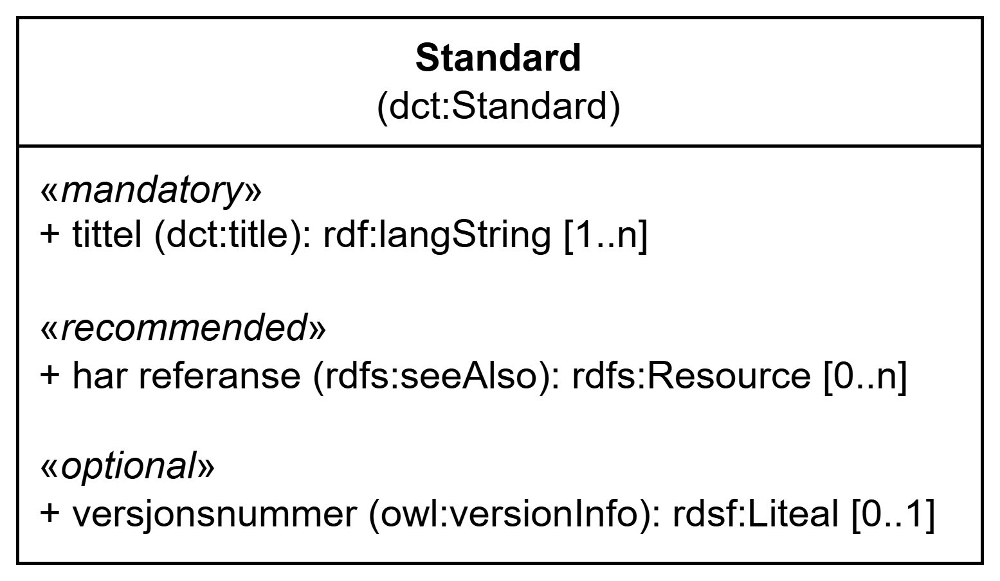

=== Klassen Standard (`dct:Standard`) [[Standard]]

[[img-KlassenStandard]]
.Klassen Standard (`dct:Standard`)
[link=images/KlassenStandard.png]

[cols="30s,70d"]
|===
| __English name__ | __Standard__
| URI | `dct:Standard`
| Anvendelse / __Usage note__ | Klassen brukes til å representere en standard/spesifikasjon.

__This class is used to represent a standard/specification.__
|===

==== Obligatoriske egenskaper for klassen __Standard__ [[Standard-obligatoriske-egenskaper]]

===== Standard – tittel (`dct:title`) [[Standard-tittel]]

[cols="30s,70d"]
|===
| __English name__ | __title__
| URI | `dct:title`
| Verdiområde / __Range__ | `rdf:langString`
| Anvendelse / __Usage note__ | Egenskapen brukes til å angi tittelen til standarden/spesifikasjonen. Egenskapen bør gjentas når tittelen finnes i flere ulike språk.

__This property is used to specify the title of the standard/specification. It should be repeated when the title exists in multiple languages.__
| Multiplisitet / __Multiplicity__ | `1..n`
| Kravnivå / __Requirement level__ | Obligatorisk / __Mandatory__
|===

==== Anbefalte egenskaper for klassen __Standard__ [[Standard-anbefalte-egenskaper]]

===== Standard – har referanse (`rdfs:seeAlso`) [[Standard-har-referanse]]

[cols="30s,70d"]
|===
| __English name__ | __see also__
| URI | `rdfs:seeAlso`
| Verdiområde / __Range__ | `rdfs:Resource`
| Anvendelse / __Usage note__ | Egenskapen brukes til å angi referanse til standarden/spesifikasjonen.

__This property is used to specify a reference to the standard/specification.__
| Multiplisitet / __Multiplicity__ | `0..n`
| Kravnivå / __Requirement level__ | Anbefalt / __Recommended__
|===

==== Valgfrie egenskaper for klassen __Standard__ [[Standard-valgfrie-egenskaper]]

===== Standard – versjonsnummer (`owl:versionInfo`) [[Standard-versjonsnummer]]

[cols="30s,70d"]
|===
| __English name__ | __version info__
| URI | `owl:versionInfo`
| Verdiområde / __Range__ | `rdsf:Liteal`
| Anvendelse / __Usage note__ | Egenskapen brukes til å angi versjonsnummeret til standarden/spesifikasjonen.

__This property is used to specify the version information of the standard/specification.__
| Multiplisitet / __Multiplicity__ | `0..1`
| Kravnivå / __Requirement level__ | Valgfri / __Optional__
|===
