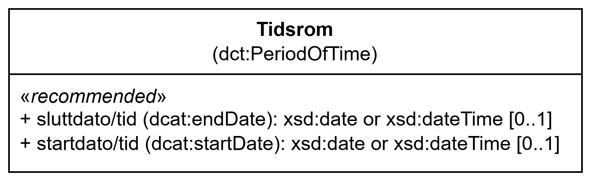

=== Klassen Tidsrom (`dct:PeriodOfTime`) [[Tidsrom]]

[[img-KlassenTidsrom]]
.Klassen Tidsrom (`dct:PeriodOfTime`)
[link=images/KlassenTidsrom.png]

[cols="30s,70d"]
|===
| __English name__ | __Period Of Time__
| URI | `dct:PeriodOfTime`
| Anvendelse / __Usage note__ | Klassen brukes til å representere et tidsrom.

__This class is used to represent a period of time.__
|===

==== Obligatoriske egenskaper for klassen __Tidsrom__ [[Tidsrom-obligatoriske-egenskaper]]

Ingen obligatoriske egenskaper er spesifisert.

==== Anbefalte egenskaper for klassen __Tidsrom__ [[Tidsrom-anbefalte-egenskaper]]

===== Tidsrom – sluttdato/tid (`dcat:endDate`) [[Tidsrom-sluttdato-tid]]

[cols="30s,70d"]
|===
| __English name__ | __end date__
| URI | `dcat:endDate`
| Verdiområde / __Range__ | `xsd:date` or `xsd:dateTime`
| Anvendelse / __Usage note__ | Egenskapen brukes til å angi slutten på tidsrommet.

__This property is used to specify the end of the period of time.__
| Multiplisitet / __Multiplicity__ | `0..1`
| Kravnivå / __Requirement level__ | Anbefalt / __Recommended__
| Merknad / __Note__ | Vær oppmerksom på at selv om begge egenskapene anbefales, skal en av de to være til stede for hver instans av klassen dct:PeriodOfTime (hvis klassen er brukt). Starten av perioden bør forstås som starten på datoen, timen, minuttet (f.eks. starter ved midnatt på begynnelsen av dagen hvis verdien er en dato). Slutten av perioden skal forstås som slutten av datoen, timen, minuttet (f.eks. slutter ved midnatt på slutten av dagen hvis verdien er en dato). 

__Note that although both properties are recommended, one of the two shall be present for each instance of the class dct:PeriodOfTime (if the class is used). The start of the period should be understood as the start of the date, hour, minute (e.g., starts at midnight at the beginning of the day if the value is a date). The end of the period should be understood as the end of the date, hour, minute (e.g., ends at midnight at the end of the day if the value is a date).__
|===

===== Tidsrom – startdato/tid (`dcat:startDate`) [[Tidsrom-startdato-tid]]

[cols="30s,70d"]
|===
| __English name__ | __start date__
| URI | `dcat:startDate`
| Verdiområde / __Range__ | `xsd:date` or `xsd:dateTime`
| Anvendelse / __Usage note__ | Egenskapen brukes til å angi  starten på tidsrommet.

__This property is used to specify the start of the period of time.__
| Multiplisitet / __Multiplicity__ | `0..1`
| Kravnivå / __Requirement level__ | Anbefalt / __Recommended__
|===

