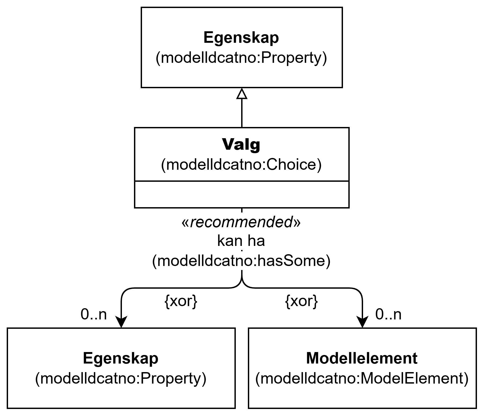

=== Klassen Valg (`modelldcatno:Choice`) [[Valg]]

[[img-KlassenValg]]
.Klassen Valg (`modelldcatno:Choice`) og klassene den refererer til
[link=images/KlassenValg.png]

[cols="30s,70d"]
|===
| __English name__ | __Choice__
| URI | `modelldcatno:Choice`
| Subklasse av / __Subclass of__ | Egenskap (`modelldcatno:Property`)
| Anvendelse / __Usage note__ | Klassen brukes til å beskrive valg.

__This class is used to describe choice.__
|===

==== Anbefalte egenskaper for klassen __Valg__ [[Valg-anbefalte-egenskaper]]

===== Valg – kan ha (`modelldcatno:hasSome`) [[Valg-kan-ha]]

[cols="30s,70d"]
|===
| __English name__ | __has some__
| URI | `modelldcatno:hasSome`
| Subegenskap av / __Subproperty of__ | `modelldcatno:hasType`
| Verdiområde / __Range__ | `modelldcatno:Property`
| Anvendelse / __Usage note__ | Egenskapen brukes til å referere til de modellelementer eller egenskaper som det kan velges blant i en gruppe av valgbare modellelementer.

__This property is used to refer to the model elements or properties that can be chosen from a group of selectable model elements.__
| Multiplisitet / __Multiplicity__ | `0..n`
| Kravnivå / __Requirement level__ | Anbefalt / __Recommended__
|===
