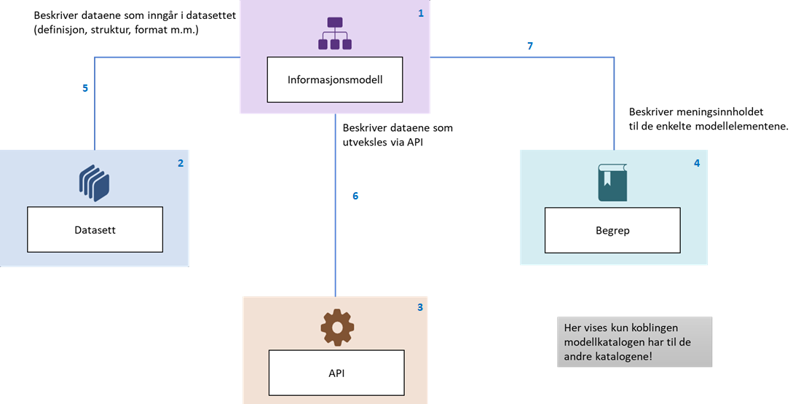

=== Å beskrive en informasjonsmodell [[om-informasjonsmodell]]

==== Hva er en informasjonsmodell? [[hva-er-informasjonsmodell]]

Med informasjonsmodell (`modelldcatno:InformationModel`) mener vi en formell beskrivelse av informasjonen en virksomhet trenger å motta eller selv produsere for å utføre sitt daglige virke. Vi legger til grunn en vid tolkning av begrepet informasjonsmodell. Den omfatter modeller på ulike abstraksjonsnivåer (som konseptuelle, logiske og fysiske modeller) og modeller som beskriver ulike aspekter ved informasjon (som felles- og anvendelsesmodeller).

*****
For ModellDCAT-AP-NO er det utarbeidet et https://data.norge.no/vocabulary/information-model-type[kontrollert vokabular for klassifisering av informasjonsmodeller &#x29C9;, window="_blank", role="ext-link"].
Dette er:

* *Konseptuell modell* er en form for kvalitativ modell som beskriver de viktigste konseptene innenfor et fagdomene og sammenhengen mellom disse.

* *Logisk modell* beskriver hvilke typer informasjon som inngår i en avgrenset sammenheng og hvordan de er logisk relatert, uavhengig av teknologi.

* *Fysisk modell* er en logisk modell som er utarbeidet for å beskrive datautveksling eller lagring av data for en bestemt løsning.

* *Fellesmodell* er en informasjonsmodell til felles bruk på tvers av virksomheter, forretningsområder og/eller applikasjonssegmenter.

* *Anvendelsesmodell* er en modell som er rettet mot et spesifikt anvendelsesområde i en avgrenset kontekst, og er sammensatt av elementer i en fellesmodell.
*****

==== Hvordan beskriver du en informasjonsmodell? [[hvordan-beskrive-infomodell]]

Kun <<Informasjonsmodell-tittel, «titte» (`dct:title`)>>, <<Informasjonsmodell-utgiver, «utgiver» (`dct:publisher`)>> (se også <<om-utgiver-og-produsent, Om ... «utgiver»>>) og <<Informasjonsmodell-kontaktpunkt, «kontaktpunkt» (`dcat:contactPoint`)>> er obligatoriske opplysninger i en beskrivelse av en informasjonsmodell. Det er med andre ord ikke påkrevd å ta med modellelementer i modellbeskrivelsen din, selv om dette er anbefalt. Hvis modellen din kun er tilgjengelig som f.eks. en bildefil, anbefales det å gjøre den tilgjengelig på en nettside og peke til denne ved bruk av <<Informasjonsmodell-finnes-i-format, «finnes i format» (`dct:hasFormat`)>>.  Det er også mulig å referere til en hjemmeside hvor modellen er nærmere beskrevet ved bruk av egenskapen <<Informasjonsmodell-hjemmeside, «hjemmeside» (`foaf:homepage`)>>.  

Hva som betraktes som større eller mindre endringer, er en faglig vurdering som tas fra sak til sak. Når du ut fra den faglige vurderingen mener at endringene i informasjonsmodellen din er så store at det kan ha betydning for hvordan informasjonsmodellen skal forstås/brukes, bør du opprette en ny instans av `modelldcatno:InformationModel` for den nye versjonen av informasjonsmodellen din, slik at den nye versjonen også får en egen identifikator. Dette gjør at både den nye og den gamle versjonen av informasjonsmodellen din kan refereres til. Du bør også bruke egenskapen <<Informasjonsmodell-erstatter, «erstatter» (`dct:replaces`)>> fra den nye versjonen til den gamle versjonen av informasjonsmodellen (ev. den motsatte egenskapen, <<Informasjonsmodell-er-erstattet-av, «er erstattet av» (`dct:isReplacedBy`)>> fra den gamle til den nye versjonen av informasjonsmodellen). For mindre endringer kan du bruke egenskapene <<Informasjonsmodell-versjon, «versjon» (`owl:versionInfo`)>> og <<Informasjonsmodell-versjonsmerknad, «versjonsmerknad» (`adms:versionNotes`)>> til å dokumentere endringene, uten at det blir opprettet en ny instans og dermed en ny identifikator.

==== Eksempler på en beskrivelse av informasjonsmodeller

<<et-illustrativt-eksempel>> viser en beskrivelse av en informasjonsmodell uten modellelementer, men med henvisning til hvor modellen finnes. 

https://data.norge.no/information-models/1f44a866-2cbd-3b80-bf72-cccb99965e25[Felles informasjonsmodell for Adresse  &#x29C9;, window="_blank", role="ext-link"] tilgjengeliggjort i modellkatalogen på data.norge.no, inneholder beskrivelser av modellelementene i tillegg til selve informasjonsmodellen. 

Det er flere informasjonsmodeller tilgjengeliggjort i https://data.norge.no/information-models[modellkatalogen på data.norge.no &#x29C9;, window="_blank", role="ext-link"], med eller uten modellelementer. 

==== Sammenheng mellom informasjonsmodell, datasett, datatjeneste og begrep [[sammenheng]]

Figuren nedenfor viser sammenhengen mellom informasjonsmodell, datasett, API (datatjeneste) og begrep. Datasett og datatjeneste er spesifisert i https://data.norge.no/specification/dcat-ap-no[Standard for beskrivelse av datasett, datatjenester og datakataloger (DCAT-AP-NO) #x29C9;, window="_blank", role="ext-link"] og begrep i https://data.norge.no/specification/skos-ap-no-begrep[Forvaltningsstandard for begrepsbeskrivelser (SKOS-AP-NO-Begrep) #x29C9;, window="_blank", role="ext-link"].

.Sammenheng mellom informasjonsmodell, datasett, datatjenester og begreper

[cols="20,80"]
|===
|*Nummerering*|*ModellDCAT-AP-NO*
|1|Informasjonsmodell (`modeldcatno:InformationModel`)
|2|Datasett (`dcat:Dataset`)
|3|Datatjeneste (`dcat:DataService`)
|4|Begrep (`skos:Concept`)
|5|i samsvar med (`dct:conformsTo`)
|6|i samsvar med (`dct:conformsTo`)
|7|begrep (`dct:subject`)
|===

Vi kan 

* referere fra en informasjonsmodell, et modellelement, en egenskap eller et kodeelement til begreper ved bruk av egenskapen «begrep» (`dct:subject`)

* referere fra et datasett eller en datatjeneste til en informasjonsmodell ved å bruke egenskapen «i samsvar med» (`dct:conformsTo`)

Eksempler i RDF Turtle:

Fra et modellelement til et begrep:

----
<https://examples.com/infomoc/exmodelelement> a modelldcatno:ModelElement ;
   dct:subject <https://example.com/concepts/dummyConcept1> .
----

Fra et datasett til en informasjonsmodell:

----
<https://examples.com/infomoc/exdataset> a dcat:Dataset ;
   dct:conformsTo <https://github.com/Informasjonsforvaltning/modelldcat-ap-no/examples/testMod1> .
----

Fra en dtatjeneste til en informasjonsmodell:

----
<https://examples.com/infomoc/exdataservice> a dcat:DataService ;
   dct:conformsTo <https://github.com/Informasjonsforvaltning/modelldcat-ap-no/examples/testMod2> .
----
